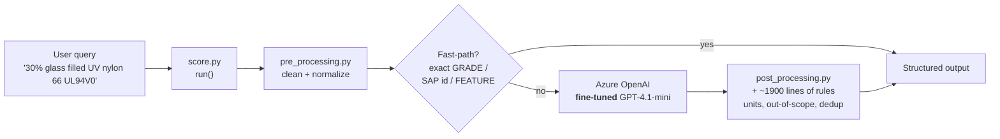
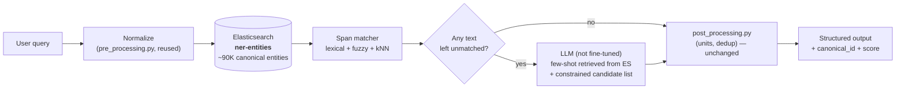
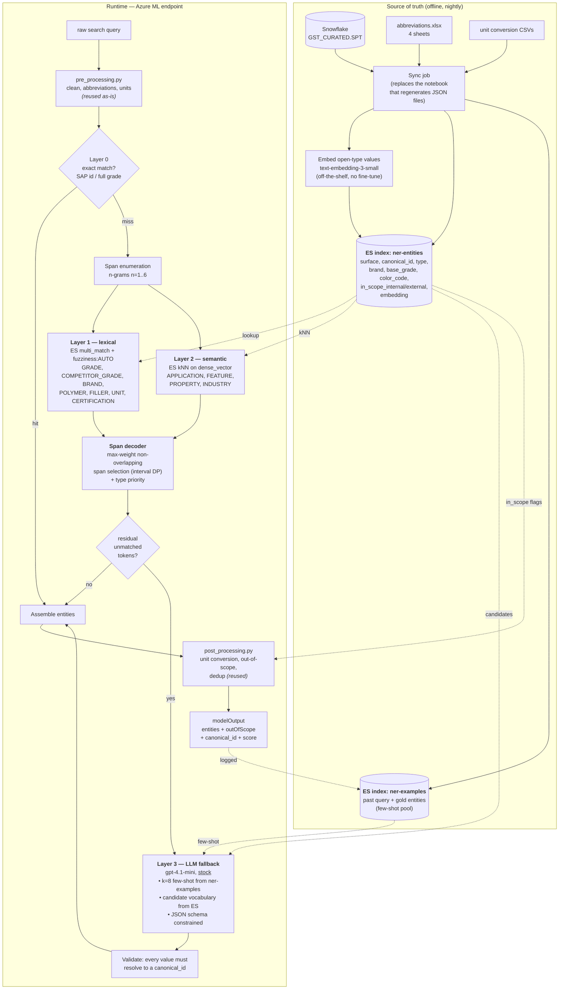
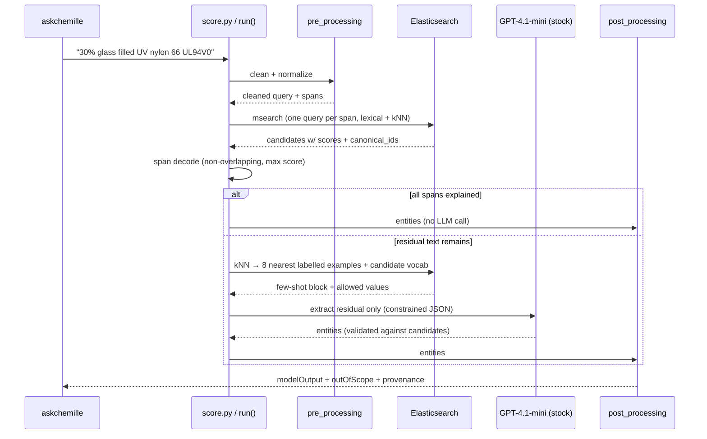
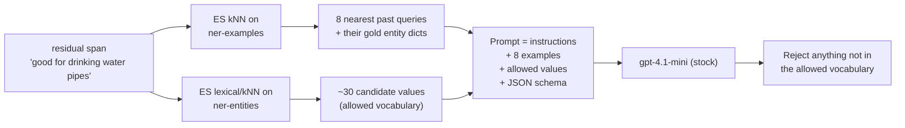
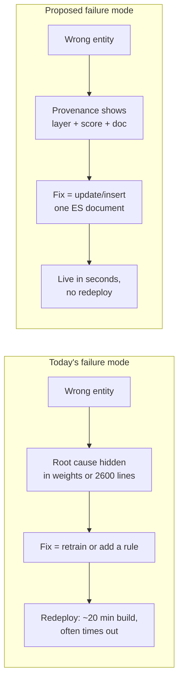
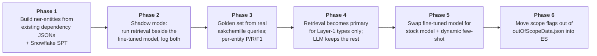
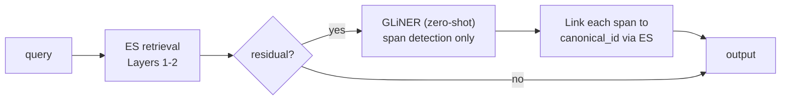

# 13 — Retrieval-Based NER (Elasticsearch) — Proposed Approach

> **Goal:** replace the *fine-tuned* GPT-4.1-mini at the centre of the pipeline with a
> **retrieval-first** architecture, so that adding/fixing an entity is a **data update in
> Elasticsearch**, not a **model retraining + redeployment** cycle.
>
> **Constraint given:** no fine-tuning. Prefer retrieval. Few-shot only where retrieval alone
> cannot decide.

---

## 0. TL;DR

| | Today | Proposed |
|---|---|---|
| Who extracts entities | Fine-tuned GPT-4.1-mini (weights) | Elasticsearch retrieval (data) + small LLM for leftovers |
| Where knowledge lives | Model weights + 12 JSON/CSV/XLSX files in `dependencies/` | One ES index (`ner-entities`), synced from Snowflake |
| Cost of a new grade | Regenerate training data → fine-tune → deploy → validate (days) | `POST /ner-entities/_doc` (seconds) |
| Cost of a wrong scope flag (bug 217995) | Regen JSON → bump model artefact → redeploy | Update one field on one document |
| LLM dependency | **Every** request (except fast-paths) | Only the residual span layer (~a minority of queries) |
| Explainability | "the model said so" | Every entity carries `canonical_id` + match score + matched rule |

---

## 1. Current approach (as implemented today)

### 1.1 Simple view



### 1.2 Where the knowledge actually sits

```mermaid
flowchart TB
    subgraph W["Model weights (Azure OpenAI)"]
        W1["17 entity types<br/>learned from ~650K generated<br/>training queries"]
    end
    subgraph D["dependencies/ — shipped as registered model 'gst-gpt-ner-model'"]
        D1["unique_values_22_02_24.json<br/>~90K surface forms"]
        D2["outOfScopeData.json"]
        D3["normalized_unique_values_for_grade_mapping.json"]
        D4["normalized_competitor_names.json"]
        D5["abbreviations.xlsx (4 sheets)"]
        D6["final_unit_conversion_table*.csv"]
        D7["ul_list_name_value.json<br/>oos_color_code_pattern.txt"]
    end
    subgraph C["Code rules"]
        C1["ner_helper.run_ner() — 1900 lines"]
        C2["post_processing.py — 700 lines"]
    end
    W1 --> X["Entity extraction"]
    D1 --> X
    D2 --> X
    D3 --> X
    D4 --> X
    D5 --> X
    D6 --> X
    D7 --> X
    C1 --> X
    C2 --> X
```



**Key observation:** the ~90K-term gazetteer in `unique_values_22_02_24.json` is **already
present at runtime** — but it is used only *after* the LLM, as a fuzzy *validator*
(`ner_helper.py:1384-1417`, `thefuzz.token_sort_ratio > 80`). The dictionary corrects the model
instead of doing the extraction.

### 1.3 Current limitations

| # | Limitation | Evidence in this repo |
|---|---|---|
| L1 | **Knowledge is frozen in weights.** A new grade/brand needs retraining. | `run_ner()` docstring: *"Handles special cases where re-training is not required"* — the rules exist purely to dodge retraining. |
| L2 | **Rule sprawl as a substitute for retraining.** 2,600 lines of Python encode business logic that is really *data*. | `ner_helper.py` 1,910 lines + `post_processing.py` 696 lines. |
| L3 | **Data lives in files inside a versioned model artefact.** Any data fix requires a model-version bump + endpoint redeploy. | Bug 217995 fix = regenerate `outOfScopeData.json` → new `gst-gpt-ner-model` version → redeploy. |
| L4 | **Silent scope errors.** In/out-of-scope is a *list difference* between two JSON arrays, so a near-miss key silently drops a grade. | `BKB009` vs `BK009` — the de-confliction never removed the grade from the OOS list. |
| L5 | **No candidate constraint on the LLM.** The model can emit a grade string that exists nowhere in the catalogue. | Fuzzy repair afterwards at `ner_helper.py:1384-1417` is a symptom of this. |
| L6 | **Every non-fast-path query costs an LLM call.** Latency + token spend + a hard external dependency. | `get_entities()` → `client.chat.completions.create`. |
| L7 | **Single point of failure.** Azure OpenAI deployment name is hard-coded per environment; a bad `.env` crashes the container at import. | `score.py:63-68`; `CLAUDE.md` "User container has crashed or terminated". |
| L8 | **No per-entity confidence or provenance.** Output is a flat dict; you cannot tell *why* something was tagged. | Output schema in `run_ner()`. |
| L9 | **Deployment is heavyweight and fragile.** Any change ⇒ ~20-min image build on a Private-Link workspace that frequently times out. | `CLAUDE.md` — `imageBuildCompute: null` gotcha. |
| L10 | **Fine-tune drift.** Model version, prompt, and dependency files must stay mutually consistent across dev/test/prod. | 5 separate `NER-Model-deployment-pipeline-*.ipynb`. |

---

## 2. Proposed approach — Retrieval-first, LLM-last

### 2.1 Simple diagram



**One-line summary:** *Elasticsearch does the recognition; the LLM only handles the words
Elasticsearch could not explain.*

### 2.2 Full architecture diagram



### 2.3 Request-level sequence



---

## 3. The deviation — what actually changes

| Aspect | Current | Proposed | Type of change |
|---|---|---|---|
| Entity recognition | Fine-tuned LLM | ES retrieval over canonical catalogue | **Core deviation** |
| LLM role | Primary extractor, every request | Fallback for residual spans only | **Core deviation** |
| LLM training | Fine-tuned on ~650K synthetic queries | **None** — stock model + retrieved few-shot | **Core deviation** |
| Knowledge store | 12 files in a registered model artefact | 2 ES indices synced from Snowflake | **Core deviation** |
| In/out-of-scope | List difference across JSON arrays | Boolean field per canonical document | **Core deviation** |
| Output guarantee | Free-form model output, fuzzy-repaired | Every value resolves to a `canonical_id` | **Core deviation** |
| `pre_processing.py` | cleans text | unchanged | reused |
| `post_processing.py` | units, OOS, dedup | unchanged (reads scope from ES instead of JSON) | mostly reused |
| Output schema | `userInput` / `modelOutput` / `outOfScope` | identical, plus optional `canonical_id`, `score` | backward-compatible |
| Azure ML endpoint | `gst-ner-endpoint-dev`, blue deployment | same | unchanged |
| Fast-paths (SAP id, exact grade) | in `run_ner()` | become Layer 0 ES `term` lookups | refactor |
| Deployment unit | code + model artefact + env | code + env (data no longer in the artefact) | simplification |

### What we are **not** changing
- The public request/response contract (askchemille integration is untouched).
- `pre_processing.py` normalization behaviour.
- Unit conversion tables and the UL property logic.
- The Azure ML managed-endpoint deployment model.

---

## 4. Index design (the part that carries the load)

### 4.1 `ner-entities` mapping (sketch)

```jsonc
{
  "settings": {
    "analysis": {
      "analyzer": {
        "mat_norm": {                       // lowercase, strip - / . and spaces, ASCII-fold
          "tokenizer": "keyword",
          "filter": ["lowercase", "asciifolding", "strip_seps"]
        },
        "mat_syn": {                        // abbreviations.xlsx -> synonym_graph
          "tokenizer": "standard",
          "filter": ["lowercase", "asciifolding", "ner_synonyms"]
        }
      }
    }
  },
  "mappings": {
    "properties": {
      "surface":       { "type": "text", "analyzer": "mat_syn",
                         "fields": { "norm": { "type": "keyword", "normalizer": "mat_norm" },
                                     "ngram": { "type": "text", "analyzer": "edge_ngram" } } },
      "canonical_id":  { "type": "keyword" },   // e.g. SPT:ZYT101F_BK009
      "entity_type":   { "type": "keyword" },   // GRADE | BRAND | POLYMER | ...
      "brand":         { "type": "keyword" },
      "base_grade":    { "type": "keyword" },   // 101f
      "color_code":    { "type": "keyword" },   // bk009   <-- separate field, see §4.3
      "in_scope_internal": { "type": "boolean" },
      "in_scope_external": { "type": "boolean" },
      "source":        { "type": "keyword" },   // snowflake:SPT | manual | abbreviation
      "updated_at":    { "type": "date" },
      "embedding":     { "type": "dense_vector", "dims": 1536, "index": true,
                         "similarity": "cosine" }   // only for open types
    }
  }
}
```

### 4.2 Which entity types go through which layer

| Layer | Entity types | Mechanism | Why |
|---|---|---|---|
| 1 — lexical | GRADE, COMPETITOR_GRADE, BRAND, POLYMER, FILLER, UNIT, CERTIFICATION, AUTO/RAILWAY/WATER/NSF_CERT, MATERIAL_ID, REGION | `multi_match` + `fuzziness:AUTO` + synonyms | closed catalogues; exact identity matters more than meaning |
| 2 — semantic kNN | APPLICATION (22K values), FEATURE, PROPERTY, INDUSTRY | `dense_vector` kNN | users phrase these freely; "parts that touch drinking water" ≠ any literal string |
| 3 — LLM fallback | residual spans, ambiguous type assignment, implicit entities | stock GPT-4.1-mini, retrieved few-shot, constrained output | language understanding that retrieval cannot supply |

### 4.3 Two concrete wins on live bugs

**Bug 217995 — `Zytel 101F BK009` wrongly out-of-scope.**
Root cause was that Snowflake held `BKB009` while the user typed `BK009`, so the OOS
de-confliction never matched. With `base_grade` and `color_code` as **separate fields**, the
match on `base_grade=101f` + `brand=zytel` succeeds regardless of the colour variant, and scope
is read from `in_scope_internal` on that document — not inferred from a list difference.
**A fix becomes a one-document update, with no redeploy.**

**Open issue — `Celanyl XS3 GF60 BG 1019/C EF` returns 0 results.**
Structured fields make the drop point visible: you can see exactly which sub-token
(`BG 1019/C`, `EF`) failed to resolve, instead of guessing whether the colour code was stripped.

---

## 5. Few-shot: yes, but *dynamic*

Static few-shot (hard-coded examples in the prompt) is not worth it here — 17 entity types with
90K values will not fit, and every business change means a prompt edit.

**Dynamic few-shot** is the right form:



Why this beats fine-tuning for this project:
- A mislabel is fixed by **inserting one example document**, not by retraining.
- The allowed-vocabulary constraint makes hallucinated grades **structurally impossible**,
  which removes the need for the fuzzy repair at `ner_helper.py:1384-1417`.
- Prompt behaviour is inspectable and diffable; weights are not.

---

## 6. Limitations *after* adopting this approach (be honest about these)

| # | New limitation | Mitigation |
|---|---|---|
| N1 | **New runtime dependency on Elasticsearch.** The endpoint now needs network access to ES Cloud; ES down = degraded NER. | Cache the hot catalogue in-process at `init()` (it is only ~90K terms); fall back to the in-memory gazetteer if ES is unreachable. |
| N2 | **Added network latency per request** (1 `msearch` round-trip, sometimes 2). | Batch all spans into a single `msearch`; co-locate ES and the endpoint in the same region. Offset by skipping the LLM call on most queries. |
| N3 | **Retrieval cannot infer implicit entities.** "food safe" → NSF certification family is world knowledge, not a string match. | That is exactly what Layer 3 is for; keep the LLM fallback, do not remove it. |
| N4 | **Fuzzy matching introduces false positives** that a fine-tuned model would have rejected in context. | Per-type score thresholds; require exact `base_grade` for GRADE; A/B the thresholds against the golden set. |
| N5 | **Embedding model choice becomes a dependency.** Changing it means re-embedding the whole index. | Pin the embedding model version; store `embedding_model` on each doc; re-index offline via alias swap. |
| N6 | **Span enumeration cost grows with query length.** n-grams up to n=6 on a long query = many candidates. | Cap n by type; prune spans that contain no in-vocabulary token; queries here are short in practice. |
| N7 | **Index/Snowflake drift.** ES becomes a second copy of the truth. | Nightly full re-index into a new index + alias swap; emit a row-count/checksum diff alert. |
| N8 | **New operational surface:** index mappings, analyzers, synonym files, credentials, ILM. | Version the mapping in this repo; ES creds to Key Vault (already an open action item in `CLAUDE.md`). |
| N9 | **Two-system debugging.** A wrong answer could originate in retrieval *or* in the LLM fallback. | Emit `layer` and `score` provenance on every entity — this is strictly better than today's opaque output. |
| N10 | **Rules do not disappear.** `post_processing.py` (units, UL conversions, dedup) is still required. | Intentional — that logic is genuinely deterministic business logic and should stay in code. |
| N11 | **Semantic recall is bounded by the catalogue.** kNN can only return values that exist in `ner-entities`. | Same bound exists today; the difference is that adding a value is now an insert. |

### Honest comparison of failure modes



---

## 7. Migration plan (low risk, no big-bang)



**Phase 1 is free of risk** — it is an offline index build from files that already exist in
`dependencies/`, and nothing in the serving path changes.
**Phase 2 gives you the evidence** to decide whether Phases 4-6 are worth doing at all.

Suggested exit criteria before Phase 4: retrieval must match or beat the fine-tuned model on
GRADE / COMPETITOR_GRADE / BRAND F1 on the golden set, with no regression in out-of-scope
precision.

---

## 8. Optional: no-LLM variant (if you want to drop Azure OpenAI entirely)

Replace Layer 3 with a **zero-shot encoder NER** — GLiNER or NuNER-Zero. You pass entity type
names at inference time and it labels spans; **no training required**, CPU-runnable.



Trade-off: removes the Azure OpenAI dependency and per-request token cost, but zero-shot encoders
are weaker than GPT-4.1-mini on implicit/multi-hop phrasing (N3). Reasonable as a **fallback for
the fallback**, or for the FEATURE/APPLICATION types specifically.

---

## 9. Open questions to settle before building

1. Which ES cluster? The training notebooks already use an Elastic Cloud instance
   (`elastic-cloud.com:9243`) — reuse it, or provision a serving-side cluster?
2. Is Snowflake `GST_CURATED.SPT` genuinely the single source of truth for **all** 17 types, or
   only for GRADE/COMPETITOR_GRADE? The other types currently originate from
   `unique_values_22_02_24.json` with no upstream owner.
3. Embedding model: Azure OpenAI `text-embedding-3-small` (same tenant, cost per call) vs a local
   `bge-small` in the container (no network, larger image)?
4. Do we have a **labelled golden set** of real queries? Phase 3 is blocked without one — the
   ~650K synthetic training queries are not a valid evaluation set for this comparison.
5. Latency budget for the endpoint — what is the current p95, and how much headroom is there?

---

## 10. Related docs

- [`02-big-picture-architecture.md`](02-big-picture-architecture.md) — the current architecture
- [`11-rulebased-vs-llm.md`](11-rulebased-vs-llm.md) — which of the 17 labels come from the model vs rules
- [`12-bug-217995-zytel-casestudy.md`](12-bug-217995-zytel-casestudy.md) — the bug this design would have made a one-line fix
- [`09-missing-files.md`](09-missing-files.md) — existing Elasticsearch usage in the training notebooks
