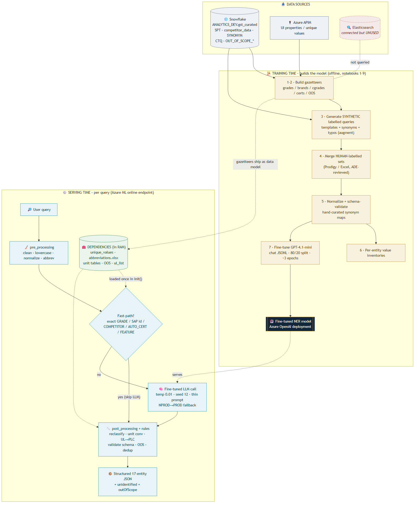

# 13. How the Chemille NER Prediction Actually Works 🧠⚙️

> A complete, plain-English explanation of the **current** NER approach: rules + LLM, the data
> and databases used, how the model recognizes entities, how it was fine-tuned, and — honestly —
> where it falls short and can fail. Verified against `onlinescoring/` and notebooks `1`–`9`.

---

> **📌 Updated 11-Aug-2026.** This document describes the **17-entity** version and remains
> accurate for the core pipeline, the data sources and the fine-tuning process. Since then the
> schema has grown to **19 entities** (`MEDICAL_CERT`, `CHEMICAL_RESISTANCE`) and
> `API_VERSION` is `v5.9.2`. §9 called for "retrieval grounding" — the new
> `chemical_resistance.json` is a first step in exactly that direction: the chemical verdict is now
> a lookup rather than a memorised fact. See
> [`16-entity-by-entity-resolution.md`](16-entity-by-entity-resolution.md) §18 and
> [`17-dependencies-files-explained.md`](17-dependencies-files-explained.md) §5a.

## 0. TL;DR (read this first)

- Chemille NER is a **hybrid** system: a **fine-tuned GPT-4.1-mini** does the language understanding,
  wrapped in **deterministic Python rules** before and after.
- The LLM recognizes entities by **fine-tuning** (learned weights) — **not RAG, not few-shot**.
  At inference it gets a *thin* prompt + the raw query; all the "knowledge" is baked into the model.
- **Serving time touches no database.** All reference data is loaded once from **local files**
  (`dependencies/`) into memory. The databases (**Snowflake**, APIM) are used only at **training/build
  time**. **Elasticsearch is wired up but not used** in this code.
- It is **not** a pure rule-based system, and it is **not** a pure LLM system — it's **LLM-first with
  rules on both sides**. Roughly **16 of 17** entities come from the LLM; **rules** correct, convert,
  and validate them; a few **fast-paths** answer without the LLM at all.
- **There is essentially no ambiguity/confidence detection.** The model returns one deterministic
  answer; the only "I don't know" signal is the `unidentified` field for junk queries. This is the
  biggest conceptual gap versus what NER is *supposed* to do.



---

## 1. How a prediction is made — rules **+** LLM

Every request runs a **3-station assembly line** (entry point `score.py → run()` → `ner_helper.py →
run_ner()`):

```
  ┌──────────────┐     ┌──────────────────┐     ┌───────────────────┐
  │  STATION 1   │     │   STATION 2       │     │   STATION 3       │
  │  CLEAN       │ ──► │  UNDERSTAND       │ ──► │  FIX & CHECK      │
  │ pre_processing│     │ fine-tuned LLM    │     │ post_processing   │
  │  .py (rules) │     │ (Azure OpenAI)    │     │  .py + rules      │
  └──────────────┘     └──────────────────┘     └───────────────────┘
```

But before Station 2, there's a shortcut:

### Fast-paths (pure rules — LLM is skipped entirely)
If the **whole query** exactly matches something in the catalog, `run_ner()` returns immediately and
**never calls the LLM** (saves latency + money):

| Fast-path | Trigger | `ner_helper.py` |
|-----------|---------|-----------------|
| **GRADE** | exact match vs `NORMALIZED_UNIQUE_VALUES['GRADE']` | ~938 |
| **COMPETITOR_GRADE** | exact match vs competitor list | ~1088 |
| **AUTO_CERT** | exact match vs auto-cert list | ~1139 |
| **FEATURE** | single-feature exact match (e.g. `pfas-free`) | ~891 |
| **MATERIAL_ID** | 8-digit SAP-id regex (starts 2/5) — the *only* purely rule-based entity | ~805 |

### The three ways the 17 labels are produced
1. **Pure rules** → `MATERIAL_ID` only.
2. **Rule fast-path** (skips LLM) → exact GRADE / COMPETITOR / AUTO_CERT / single FEATURE.
3. **LLM-extracted, then rule-corrected** → the other 16 labels by default. **Every** LLM output is
   post-processed.

> **Design philosophy (from the repo README):** *"Avoid frequent finetuning if a NER issue can be
> fixed by a rule-based approach."* → most fixes live in rules, not the model.

---

## 2. The important rules applied (short tour)

**Pre-processing rules** (`pre_processing.py`): lowercasing, whitespace/`%` handling, symbol
stripping, abbreviation expansion (`gf` → `glass fiber` via `abbreviations.xlsx`), a "normalized"
no-space form used for exact matching.

**Post-processing rules** (`ner_helper.py` + `post_processing.py`) — the load-bearing ones:

| Rule | What it does |
|------|--------------|
| **GRADE ⇄ COMPETITOR fuzzy reclassify** | if the LLM mislabels, `thefuzz` (>80%) moves it to the right bucket |
| **Color-code stripping** | strips color codes from grade names so search matches |
| **Unit conversion** | `GPa → MPa` etc. via unit-conversion CSV tables |
| **UL → PLC mapping** | converts raw UL numbers (CTI/HAI/HWI/HVAR/HVTR/Arc) into Performance Level Categories (PLC 0–4) |
| **eco-r / eco-b / eco-c → FEATURE** | recycled / bio-content / carbon-capture expansion |
| **Brand validation** | LLM BRANDs are checked against the known brand list; invalid ones removed |
| **Synonym normalization** | many surface forms → one canonical value (e.g. `v0` → `v-0`) |
| **Schema validation** | `validate_result_dict()` enforces the exact shape of every nested entity; missing keys auto-filled with `None`/`['all']` |
| **Out-of-scope (OOS) filtering** | hides grades/brands a given `user_type` (internal vs external) shouldn't see |
| **Deduplication** | removes repeated values in every list |

---

## 3. What data is used, and from where (Snowflake? Elasticsearch? other?)

This is the part people get wrong, so be precise: **build-time vs run-time are different.**

### Build / training time (offline — notebooks 1–9)
| Store | Role | Read/Write |
|-------|------|-----------|
| **❄️ Snowflake** `ANALYTICS_DEV.gst_curated` | **Source of truth.** Tables: `SPT` (product/grades), `competitor_data`, `SYNONYM`, `CTQ` (property vocabulary), `OUT_OF_SCOPE_{BRANDS,POLYMERS,GRADES,FILLERS}` | **Read** |
| **🔌 Azure APIM** | UI-properties function → unique values / gazetteer inputs | Read (POST) |
| **🔍 Elasticsearch** | **Imported/configured but never queried** in these files — a dead/leftover wiring | *unused* |
| **🤖 Azure OpenAI** | file upload + fine-tune (notebook 7); inference tests (8) | Write/Read |
| **☁️ Azure ML** | hosts the deployed scoring endpoint (tested in notebook 9) | — |

### Run / serving time (per query — `onlinescoring/`)
- **No live database is touched.** `init()` loads everything **once** from local files in
  `dependencies/` into the in-memory `DEPENDENCIES` dict:
  `unique_values_*.json` (gazetteer), `abbreviations.xlsx` (4 sheets), unit-conversion CSVs,
  `outOfScopeData.json`, `ul_list_name_value.json`, `normalized_*` JSONs, color-code patterns.
- The only network call per request is to **Azure OpenAI** (the fine-tuned model).

> **So: Snowflake is the origin of the reference data, but at query time the service runs entirely
> off the local `dependencies/` snapshot that ships with the model — Elasticsearch is not part of the
> live path.**

---

## 4. How the LLM recognizes entities — RAG? few-shot? context?

**None of RAG or few-shot. It's a fine-tuned model.** Concretely (`ner_helper.get_entities`, line ~525):

```python
client.chat.completions.create(
    seed=12,               # reproducible
    temperature=0.01,      # near-deterministic
    model=deployment_name, # the fine-tuned GPT-4.1-mini
    messages=[
        {"role": "system", "content": ner_prompt},  # a THIN instruction, no examples
        {"role": "user",   "content": query},        # just the cleaned query
    ],
)
```

- The **system prompt is tiny** (`score.py:69`): *"Act as an NER model trained on the data corpus of
  'Celanese'… output a structured dictionary."* It contains **no entity list, no examples, no
  retrieved documents.**
- **Where does the "knowledge" come from?** From the **model weights**, adjusted during fine-tuning.
  The model *memorized the mapping* "query → 17-key entity dict" from ~tens of thousands of examples.
- **No retrieval (RAG):** the model is **not** given the gazetteers or any context at inference. The
  gazetteers are used only by the **rules** (fast-paths, validation), not by the LLM.
- **Deterministic:** `temperature=0.01` + `seed=12` → the same query gives the same answer (important
  for consistent search).
- **Reliability:** if the primary deployment (NPROD) fails, it falls back to the other (PROD).

**Implication:** the model can only recognize entities whose *language patterns* it saw during
fine-tuning. A brand-new phrasing it never trained on may be missed — and no retrieval step can
rescue it, because there is no retrieval step.

---

## 5. How the model is fine-tuned, and on what data (notebook 7)

- **Base model:** `gpt-4.1-mini` (earlier iterations used `gpt-4o-mini`).
- **Format:** OpenAI **chat JSONL**, one example per line:
  ```json
  {"messages": [
     {"role": "system",    "content": "<thin Celanese NER prompt>"},
     {"role": "user",      "content": "<search query>"},
     {"role": "assistant", "content": "<the 17-key entity dict as a string>"}
  ]}
  ```
- **Training data = synthetic + human**, built by notebooks 1–6:
  - **Synthetic (notebook 3):** template-driven generation from the gazetteers — fills
    "[grade] [polymer] with [filler]%…" templates, injects **synonyms, abbreviations, typos, and
    no-space variants** so examples look like real messy searches. Balanced with per-entity thresholds.
  - **Human-labelled (notebook 4):** ~15 ADE-reviewed Excel/Prodigy sets merged, deduped, ID'd.
  - **Normalized (notebook 5):** every value canonicalized via hand-curated synonym maps + schema-validated.
- **Split:** `train_test_split(test_size=0.20, random_state=42)` → **80% train / 20% validation**.
- **Epochs:** default target **~3** (auto-adjusted by dataset size).
- **Token budget:** examples over **4096 tokens** are flagged (would be truncated).
- **Versioning:** everything is stamped `VERSION` (currently `15_04_2026`); deploying references a
  specific model + data version.

So the model is taught to **emit the exact structured dict** — the schema is learned from the
`assistant` messages, which is why "adding a new entity type" means changing the training data (and
the validators), not the prompt.

---

## 6. Is the current approach, as a whole, "rule-based"?

**No — it's a hybrid, and mostly LLM-driven for recognition.** A fair characterization:

- **Recognition / language understanding → LLM** (16/17 labels originate here).
- **Correctness / business logic → rules** (reclassification, unit/PLC conversion, OOS, validation,
  dedup, and the exact-match fast-paths).
- **Pure rules → only `MATERIAL_ID`.**

Think of it as: **the LLM proposes, the rules dispose.** The heavy rule layer exists *because*
fine-tuning is expensive — it's cheaper to patch a rule than to retrain — not because the system is
fundamentally rule-based.

---

## 7. Is there any ambiguity detection? (the honest answer: barely)

A core purpose of NER is to **resolve ambiguity between classes** (is "PA66" a POLYMER or part of a
GRADE?) and to **know when it's unsure**. In this system:

**What little exists:**
- **GRADE ⇄ COMPETITOR_GRADE** disambiguation via `thefuzz` similarity (>80%) — a *rule*, not model
  confidence.
- **BRAND validation** — drops values not in the known brand list.
- **`unidentified` field** — if the query is junk/non-searchable, it's returned as `unidentified`
  rather than forced into entities. This is the closest thing to an "abstain."
- **Determinism** (`temp 0.01`, `seed 12`) — consistent, but consistency ≠ correctness.

**What's missing:**
- **No confidence scores.** A fine-tuned chat model returns text, not per-entity probabilities — so
  there's no threshold to say "low confidence, flag for review."
- **No explicit ambiguity/abstention** for genuinely ambiguous *entities* (only for whole-junk queries).
- **No alternative candidates** ("could be POLYMER or FILLER") — it commits to one answer.
- **No calibration / uncertainty signal** downstream systems could use.

> **Bottom line:** ambiguity is handled *implicitly* by the model's training and a few fuzzy rules,
> not by an explicit ambiguity-detection or confidence mechanism. When the model is wrong, it is
> **confidently wrong** and silently so.

---

## 8. Where the current model / approach can actually fail

Concrete, code-grounded failure modes:

1. **Unseen vocabulary / phrasing.** No RAG means a new grade/brand/synonym the model never trained on
   can be missed or mislabeled — and only a matching **rule** (if someone added it to `dependencies/`)
   can catch it. Otherwise it slips through.
2. **Confidently-wrong class assignment.** With no confidence signal, a misclassification (e.g.
   POLYMER vs FILLER, GRADE vs COMPETITOR) surfaces as a clean-looking answer that's simply wrong.
3. **Data/knowledge gaps (not model gaps).** If the answer isn't in the underlying data, perfect NER
   still returns nothing useful — the **Zytel/Celanyl OOS bug (217995)** was exactly this: a data
   de-confliction miss, not a model error. See `12-bug-217995-zytel-casestudy.md`.
4. **CTQ → application/grade mapping.** The hardest queries ("grade for *this application* meeting
   *these CTQs*") require relational knowledge the flat entity extraction doesn't capture — a known
   **bottleneck** (see the 7/20 RCA notes).
5. **Nested-entity structure errors.** The 6 structured entities (PROPERTY, FILLER, AUTO_CERT,
   RAILWAY_CERT, WATER_CERT, NSF_CERT) are where the LLM most often returns a malformed shape; the
   `validate_*` rules repair some, but bad values still pass.
6. **Synonym-map staleness.** Normalization leans on huge hand-maintained dictionaries (notebook 5) —
   they rot without human upkeep, so new synonyms silently fail to normalize.
7. **Latency / reliability.** The current agentic direction reports ~10s/message, up to 5-min
   resolution — a serving-side failure mode for UX even when extraction is correct.
8. **Overfitting to a tiny test set.** Only ~20 ADE use cases → passing them ≠ generalizing; real
   failures hide outside that set.

---

## 9. Shortcomings / limitations — what's missing in the current practice

- **No confidence or ambiguity detection** (Section 7) — the single biggest conceptual gap.
- **No retrieval grounding (RAG).** Recognition is frozen at fine-tune time; new catalog items need a
  retrain **or** a hand-added rule. A retrieval layer over the gazetteers could ground the model on
  live data and reduce retrains.
- **Heavy hand-maintained rule/synonym layer** — powerful but brittle and hard to keep current.
- **Thin evaluation.** Small, ADE-authored test set; no large data-grounded regression suite or
  per-entity metrics → overfitting risk and blind spots.
- **CTQ ↔ application ↔ grade relationships are not modeled** — flat entity lists can't express "which
  grade satisfies which requirement for which use," which is the actual business question.
- **Secrets in notebooks / dependency files not in git** — operational risk (see `ner-code-info.md`).
- **Elasticsearch wired but unused** — dead configuration that misleads readers about the live path.

**Natural next steps (matching the team's "new architecture" notes):** add **chemistry reasoning**
into the flow, build **knowledgebase/data frameworks** (capture CTQ↔app↔grade + ADE knowledge),
introduce **RAG grounding**, add **confidence/ambiguity signals**, and stand up **proper agent
evaluation**.

---

## 10. One-paragraph summary

Chemille NER cleans a query with **rules**, tries **exact-match fast-paths** (which skip the model),
otherwise sends the query to a **fine-tuned GPT-4.1-mini** on Azure OpenAI that recognizes the 17
entity types purely from **learned weights** (no RAG, no few-shot, thin prompt, `temp 0.01`/`seed 12`),
then runs the model's output through a **heavy rule layer** (reclassify, unit/UL→PLC convert, validate
schema, out-of-scope filter, dedup) to produce a structured 17-entity JSON. The reference data
originates in **Snowflake** (via notebooks 1–9) but at serving time lives entirely in a **local
in-memory snapshot** — **Elasticsearch is not used**. The model was fine-tuned on **synthetic +
human-labelled** examples (80/20 split, ~3 epochs) formatted as chat JSONL. The approach is **hybrid,
LLM-first**, has **almost no ambiguity/confidence detection**, and fails mainly on **unseen
vocabulary, confidently-wrong classes, data/knowledge gaps, and the unmodeled CTQ→application→grade
relationship.**

⬅️ Back to [`00-README-START-HERE.md`](00-README-START-HERE.md) · related:
[`11-rulebased-vs-llm.md`](11-rulebased-vs-llm.md) ·
[`12-bug-217995-zytel-casestudy.md`](12-bug-217995-zytel-casestudy.md)
