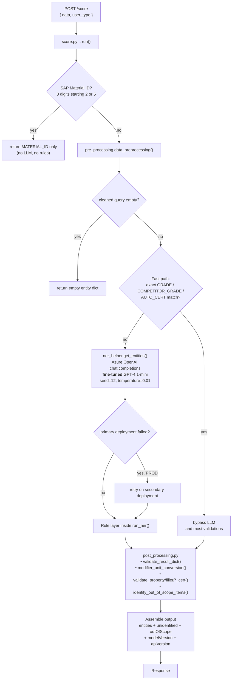

# 14 — Master Project Reference

> **Single consolidated reference** for the Celanese NER service (`NLP-NER-Model-API`).
> Covers: what the project is for, how it is built, what constrains it, what was investigated and
> fixed, and what remains open. Everything here is either verified against the code in this repo
> or explicitly marked as unverified.
>
> Companion docs: [`00-README-START-HERE.md`](00-README-START-HERE.md) (learning path),
> [`13-elasticsearch-retrieval-approach.md`](13-elasticsearch-retrieval-approach.md) (future architecture proposal).

---

## PART 1 — CORE GOALS

### 1.1 Business goal

Turn a **free-text material search** typed by a human into a **structured entity dictionary** that
downstream product search can filter on.

```
Input:   "30% glass filled UV resistant nylon 66 with UL94V0"
Output:  { POLYMER: ["nylon 66"], FILLER: ["glass fiber"], FILLER_PERCENTAGE: ["30 %"],
           FEATURE: ["uv resistant"], PROPERTY: ["ul94 v0"], ... }
```

This powers product search on **askchemille.com**. Search quality depends directly on NER
quality: a missed or mislabelled entity means the user gets zero results for a product Celanese
actually sells.

### 1.2 Engineering goals (in priority order)

| # | Goal | How it shows up in the code |
|---|---|---|
| G1 | **Correct entity extraction across 17 types** | The whole pipeline |
| G2 | **Avoid retraining wherever a rule can do the job** | Explicit project principle: *"Avoid frequent finetuning if a NER issue can be fixed by a rule-based approach."* Encoded as ~2,600 lines of post-model rules. |
| G3 | **Deterministic business logic stays in code, not in the model** | Unit conversion, out-of-scope, dedup all live in `post_processing.py` |
| G4 | **Fast paths must skip the LLM** | Exact GRADE / SAP material ID / FEATURE short-circuits in `run_ner()` |
| G5 | **Internal vs external users see different scope** | `user_type` threads through to `identify_out_of_scope_items()` |
| G6 | **Stable public contract** | `userInput` / `modelOutput` / `modelVersion` / `apiVersion` schema is fixed |

### 1.3 Design philosophy: hybrid

> **LLM for language understanding + deterministic rules for business logic.**

Neither alone is sufficient. The LLM cannot be trusted with unit conversion or commercial scope
rules; rules alone cannot handle the open-ended phrasing users type.

---

## PART 2 — ARCHITECTURE

### 2.1 Runtime flow (verified against code)



### 2.2 The three files that matter

| File | Lines | Role |
|---|---|---|
| `onlinescoring/score.py` | 397 | Azure ML contract. `init()` loads all reference data once at container start; `run()` handles one request. Holds GPT deployment names, `GPT_PROMPT`, `MODEL_VERSION`, `API_VERSION`. |
| `onlinescoring/ner_helper.py` | 1,910 | Orchestrator. `run_ner()` is the main entry; `get_entities()` is the only Azure OpenAI call. Also holds abbreviation replacement, UL/property value conversions, auto-cert validation, industry inference, fuzzy grade repair. |
| `onlinescoring/post_processing.py` | 696 | Deterministic business logic: unit conversion, per-type validation, and out-of-scope determination. |
| `onlinescoring/pre_processing.py` | 365 | Text cleaning: spacing, bracket/character removal, hyphen handling, property short-forms, and `normalize_query()` used for grade matching. |

### 2.3 Entity taxonomy — 17 output types

From the output schema in `run_ner()`:

`GRADE` · `APPLICATION` · `BRAND` · `POLYMER` · `PROPERTY` · `FILLER` · `FEATURE` ·
`PROCESSING` · `DELIVERY_FORM` · `COMPETITOR_GRADE` · `AUTO_CERT` · `RAILWAY_CERT` ·
`WATER_CERT` · `NSF_CERT` · `INDUSTRY` · `REGION` · `MATERIAL_ID`

Out-of-scope block reports a narrower set: `GRADE`, `BRAND`, `POLYMER`, `FILLER`, `OTHERS`.

Internally the gazetteer carries additional working types not all surfaced directly —
`MODIFIER`, `UNIT`, `FILLER_PERCENTAGE`, `CERTIFICATION`, `GRADE_WITHOUT_BRAND`,
`COMPETITOR_GRADE_TRANSFORMED`, `COMP_GRADE_WITHOUT_BRAND`, `COMP_GRADE_TRANSFORMED_WITHOUT_BRAND`.

### 2.4 Reference data (`dependencies/`) — loaded once in `init()`

| File | Contents | Consumed by |
|---|---|---|
| `unique_values_22_02_24.json` | ~90K surface forms across all types. Largest: APPLICATION 22,475 · COMPETITOR_GRADE_TRANSFORMED 18,064 · COMP_GRADE_TRANSFORMED_WITHOUT_BRAND 14,300 · COMP_GRADE_WITHOUT_BRAND 9,142 · COMPETITOR_GRADE 8,822 · PROPERTY 3,585 · CERTIFICATION 3,116 · GRADE 1,997 · GRADE_WITHOUT_BRAND 1,865 · MODIFIER 1,715 · FEATURE 862 · FILLER 782 · UNIT 265 · POLYMER 229 · BRAND 64 · FILLER_PERCENTAGE 14 | fuzzy validation, `GRADE_NAMES`, `get_filtered_values()` |
| `outOfScopeData.json` | OOS `grades` / `gradesExternal` + in-scope `gradesInScope` / `gradesInScopeExternal`, brands, polymers, fillers | `identify_out_of_scope_items()` |
| `normalized_unique_values_for_grade_mapping.json` | normalized→canonical grade map | grade fast-path |
| `normalized_competitor_names.json` | normalized competitor names | competitor grade matching |
| `abbreviations.xlsx` | 4 sheets: `PROPERTY`, `FILLER`, `FEATURE`, `common_abb` | `replace_abbreviation()` |
| `final_unit_conversion_table.csv` + `..._for_exeptions.csv` | unit conversion rules | `modifier_unit_conversion()` |
| `ul_list_name_value.json` | UL property names, synonyms, values | UL term handling |
| `oos_color_code_pattern.txt` | colour-code regex (latin-1 encoded) | out-of-scope colour handling |

These files ship as the **registered model artefact** `gst-gpt-ner-model`, resolved at runtime via
`AZUREML_MODEL_DIR`.

### 2.5 The model

- **Azure OpenAI, fine-tuned GPT-4.1-mini** — not a stock prompted model.
- The system prompt (`score.py:69`) is one generic sentence; the NER behaviour lives in the
  fine-tuned weights, which is why the prompt is so short.
- Deployments are environment-specific and hard-coded:
  - NPROD: `aif-gpt-4-1-mini-NER-2026-04-17-aif-gst-ussc-01`
  - PROD: `aif-gpt-4-1-mini-NER-2026-05-11-aif-gst-ussc-01-prod`
- `MODEL_VERSION = "GPT-4-1-mini-17_04_26"`, `API_VERSION = "v5.8.4"`.
- Call settings: `seed=12`, `temperature=0.01` for near-determinism.
- Training corpus was ~650K synthetic queries generated from templates
  (`Development files/Sample user queries from templates ... - 650K.ipynb`).

### 2.6 Deployment topology

| Component | Value |
|---|---|
| Azure ML workspace | `ml-gst-dev-usscc-01` |
| Resource group | `rg-gst-dev-ussc-01` |
| Endpoint (dev) | `gst-ner-endpoint-dev`, deployment `blue` |
| Registered model | `gst-gpt-ner-model` (carries `dependencies/`) |
| Environment | `gst-ner-env` (built from `environment/conda.yaml`) |
| Code asset | `./onlinescoring` — uploaded per deploy, **must include `.env`** |
| ACR | `crgstmlnpussc01.azurecr.io` |
| Storage | `sagmlstoredev01` (Private Link) |
| Upstream data | Snowflake `celanese-celanytics.privatelink`, db `analytics_dev`, schema `GST_CURATED`, warehouse `reporting_wh` |
| Secondary system | Elasticsearch Cloud (`elastic-cloud.com:9243`) — currently **offline/training-data only**, not in the serving path |

A deploy = **three** independently versioned things: code asset, model artefact, environment.
A data-only fix (e.g. `outOfScopeData.json`) needs a new **model** version but **no image rebuild**.

### 2.7 Environments

Five deployment notebooks exist at repo root: `local`, `dev`, `test`, `pfx`,
`dev-public-deployment`, `prod`. `ENVIRONMENT` is a hard-coded constant in `score.py:63`.

---

## PART 3 — CONSTRAINTS

### 3.1 Hard technical constraints

| # | Constraint | Consequence |
|---|---|---|
| C1 | **Python 3.10** (upgraded from EOL 3.8). Container Python = 3.10.20. | Data notebooks need 3.10/3.11 with the `[pandas]` extra for Snowflake (pyarrow). |
| C2 | **Never pin what `azureml-defaults` controls** — `pydantic`, `pydantic-core`, `azureml-inference-server-http`. | Pinning `pydantic==2.10.6` caused `ResolutionImpossible`; `azureml-defaults==1.62.0` needs `~=2.11/2.12`. |
| C3 | `inference-schema[numpy-support]~=1.8`, **not** `==1.5`. | `==1.5` conflicts with `azureml-defaults==1.62.0`. |
| C4 | **`onlinescoring/.env` must be present in the code asset.** | Missing → `AzureOpenAI(api_key=None)` raises at import → *"User container has crashed or terminated"*. It is `.gitignore`d (correct) but deliberately **not** `.amlignore`d. |
| C5 | **`imageBuildCompute` is `null`** on this Private-Link workspace → builds run on serverless compute that cannot reach `sagmlstoredev01`. | Image builds hang or time out. Workaround: reuse a previously-succeeded environment version. |
| C6 | Notebooks authenticate with **`AzureCliCredential`**, not `DefaultAzureCredential`; token lasts ~8h. | `az login --use-device-code` to refresh. |
| C7 | Snowflake uses `authenticator=externalbrowser` (SSO). | **VPN required**; cannot run headless/in CI as-is. |
| C8 | **Dependency data files and `.env` are not in git.** | A fresh checkout cannot start the service until they are restored. |

### 3.2 Operational constraints

- **~20-minute cloud image build**, frequently failing → validate the *full* `conda.yaml` locally
  first with `pip install --dry-run`. Validating only `requirements.txt` misses the conflicts,
  because it omits `azureml-defaults`.
- Base image is pinned to `:latest` — an unpinned moving target.
- **Secrets are hard-coded** in dev notebooks (Snowflake, DevOps PAT, Azure OpenAI key). Not yet
  in Key Vault.
- Repo structure is unstandardised: runtime code, notebooks, config, data and committed temp
  files (`*.amltmp`) all coexist at root.
- Clipboard/file handling gotcha: **32 KB truncation** when moving large dependency content, and
  `abbreviations.xlsx` must retain all **4 sheets**.

### 3.3 Design constraints (self-imposed, deliberate)

- Fix with a rule before retraining (G2).
- Do not change the public response schema — askchemille depends on it.
- Keep unit conversion and scope logic out of the model.

---

## PART 4 — WHAT WAS INVESTIGATED AND SOLVED

### 4.1 Bug 217995 — `Zytel 101F BK009` wrongly out-of-scope ✅ Fixed

**Symptom:** an in-catalogue grade was flagged out of scope, returning no search results.

**Root cause (data, not code):**
`identify_out_of_scope_items()` flags a grade when it appears in the OOS `grades`/`gradesExternal`
lists **and** is absent from `gradesInScope`/`gradesInScopeExternal`. The Snowflake in-scope master
(`GST_CURATED.SPT`) held only a **colour-code variant** — `BKB009` where the user typed `BK009` —
so the notebook's de-confliction step (`OOS grades − in-scope grades`) never removed the grade
from the OOS list.

**Fix:**
1. Corrected the Snowflake source so the grade is in-scope in `SPT`.
2. Regenerated `dependencies/outOfScopeData.json` via
   `Development files/1. Clean out of scope Data.ipynb` (writes only that one file).
3. Validated: `zytel101fbk009` moved out of the OOS lists into the in-scope lists; end-to-end
   simulation shows not flagged for internal and external.

**Key property:** the fix is **code-independent** — it ships on the existing image, no rebuild
required (only a model-artefact version bump + redeploy).

### 4.2 Bug 217962 — `Zytel 103HSL BK080` ✅ Fixed

Same root cause and same data regeneration. Confirmed `zytel103hslbk080` moved to the in-scope
lists.

### 4.3 `Celanyl XS3 GF60 BG 1019/C EF` ⏳ Open

Full grade is already in scope but the search returns 0 results. Hypothesis: the colour code is
being stripped, or the failure is downstream of NER. Next step is to capture
`entities.GRADE` from the endpoint for this exact query.

### 4.4 Python 3.8 → 3.10 upgrade ✅ Done

Working `environment/conda.yaml`:

```yaml
channels: [conda-forge]
dependencies:
  - python=3.10
  - numpy=1.24.4
  - pip
  - pip:
    - azureml-defaults==1.62.0
    - inference-schema[numpy-support]~=1.8      # NOT ==1.5
    - openai==1.61.1
    - pandas==2.0.3
    - thefuzz==0.22.1
    - rapidfuzz
    - openpyxl==3.1.5
    - python-dotenv==1.0.1
    # DO NOT pin pydantic / pydantic-core
```

Removed unused libraries — `spello`, `nltk`, `sympy`, `contractions`, `regex`, `joblib`,
`python-Levenshtein` (not imported anywhere; `thefuzz` uses `rapidfuzz`).

**Principle established:** pin only application libraries; never pin what `azureml-defaults`
controls.

### 4.5 Deployment failures diagnosed ✅

- `ResolutionImpossible` → stale pins (see C2/C3).
- Image build hang/timeout → `imageBuildCompute: null` + Private Link (C5).
- Container crash at startup → missing `.env` (C4).

### 4.6 Architecture proposal: Elasticsearch retrieval-based NER 📋 Designed, not built

Documented in full in [`13-elasticsearch-retrieval-approach.md`](13-elasticsearch-retrieval-approach.md).

**Motivation:** the cost of every fix today is a retrain or a redeploy. The proposal makes a fix a
**data update**.

**Core idea:** invert the current order. Today the 90K-term gazetteer is loaded at runtime but
used only *after* the LLM, as a fuzzy validator (`ner_helper.py:1384-1417`). Instead:

| Layer | Handles | Mechanism |
|---|---|---|
| 0 | SAP id, exact grade | ES `term` on normalized keyword |
| 1 | GRADE, COMPETITOR_GRADE, BRAND, POLYMER, FILLER, UNIT, CERTIFICATION | ES lexical + `fuzziness:AUTO` + synonym graph |
| 2 | APPLICATION, FEATURE, PROPERTY, INDUSTRY | ES `dense_vector` kNN, off-the-shelf embeddings |
| 3 | residual spans only | **Stock** GPT-4.1-mini with retrieved (dynamic) few-shot + constrained candidate vocabulary |
| 4 | units, scope, dedup | `post_processing.py`, unchanged |

**Key decisions taken:**
- **No fine-tuning** — dynamic few-shot retrieved from an ES example index, not static prompt examples.
- **Constrained output** — every emitted value must resolve to a `canonical_id`, making
  hallucinated grades structurally impossible and removing the need for fuzzy repair.
- **Split `base_grade` and `color_code` into separate indexed fields** — this alone would have
  made bug 217995 a one-document update rather than a regen + redeploy.
- **Scope becomes a boolean field** on the canonical document, not a difference between two JSON
  arrays — removing the failure mode entirely.
- **Elasticsearch Cloud already exists** in the org (used by the training-data notebooks), so this
  reuses provisioned infrastructure.
- **Phased, shadow-mode migration** — Phase 1 (offline index build) touches nothing in the
  serving path.

**Accepted trade-offs:** ES becomes a runtime dependency, added network latency, fuzzy false
positives, index/Snowflake drift, and two-system debugging. Rules in `post_processing.py` do not
go away — that is intentional.

**Blocked on:** a labelled golden set of real queries. The 650K synthetic training queries are not
a valid evaluation set for this comparison.

---

## PART 5 — KNOWN LIMITATIONS OF THE CURRENT SYSTEM

| # | Limitation |
|---|---|
| L1 | Knowledge is frozen in fine-tuned weights — a new grade or brand needs retraining. |
| L2 | Rule sprawl substitutes for retraining: 2,600 lines encode what is really data. |
| L3 | Reference data lives inside a versioned model artefact — any data fix needs a version bump + redeploy. |
| L4 | Scope is a list difference between JSON arrays, so a near-miss key silently drops a grade (the 217995 failure mode). |
| L5 | The LLM is unconstrained — it can emit a grade that exists nowhere in the catalogue; fuzzy repair afterwards is a symptom. |
| L6 | Every non-fast-path query costs an LLM call: latency, tokens, and a hard external dependency. |
| L7 | Single point of failure — hard-coded deployment names; a missing `.env` crashes the container at import. |
| L8 | No per-entity confidence or provenance in the output. |
| L9 | Deployment is heavyweight: ~20-min image build on a workspace that frequently times out. |
| L10 | Model version, prompt, and dependency files must stay mutually consistent across five environments. |

---

## PART 6 — OPEN ITEMS

### Immediate
- [ ] Confirm dev verification for both Zytel grades, then **promote to prod** (same
      `outOfScopeData.json` + redeploy prod endpoint).
- [ ] Investigate **Celanyl XS3 GF60 BG 1019/C EF** — capture `entities.GRADE` to see whether the
      colour code is dropped.
- [ ] Add the missing `gradesExternal` de-confliction line in
      `Development files/1. Clean out of scope Data.ipynb`.

### Hardening
- [ ] Pin the base image away from `:latest`.
- [ ] Set `imageBuildCompute` to a dedicated in-VNet cluster.
- [ ] Move secrets to Key Vault (Snowflake, DevOps PAT, Azure OpenAI key); remove hard-coded
      credentials from dev notebooks.
- [ ] Standardise the repo structure (runtime / notebooks / config / data); drop committed
      `*.amltmp` files.

### Strategic
- [ ] Build a **labelled golden set** from real askchemille queries — prerequisite for any
      architecture change.
- [ ] Phase 1 of the ES proposal: offline index build from `unique_values_22_02_24.json` +
      Snowflake `SPT` (zero serving-path risk).
- [ ] Shadow-mode comparison of retrieval vs the fine-tuned model.

---

## PART 7 — QUICK REFERENCE

### Verify a grade end-to-end (dev)

```python
import json
def check_grade(query, user_type=None):
    payload = {"data": query}
    if user_type: payload["user_type"] = user_type
    with open("req.json","w") as f: json.dump(payload, f)
    r = json.loads(ml_client.online_endpoints.invoke(
        endpoint_name=endpoint_name, deployment_name="blue", request_file="req.json"))
    ent, oos = r["modelOutput"]["entities"], r["modelOutput"]["outOfScope"]
    print(query, "| GRADE:", ent["GRADE"], "| COMP:", ent["COMPETITOR_GRADE"],
          "| oos.active:", oos["active"], "| oos.GRADE:", oos["entities"]["GRADE"])

check_grade("Zytel 101F BK009")      # PASS = absent from oos.GRADE, present in GRADE/COMPETITOR_GRADE
check_grade("Zytel 103HSL BK080")
```

### Request / response shape

```jsonc
// request
{ "data": "30% glass filled UV nylon 66 UL94V0", "user_type": "internal" }   // default: "external"

// response
{ "userInput":   { "searchQuery": "..." },
  "modelOutput": { "entities": { "GRADE": [], "APPLICATION": [], /* 17 types */ },
                   "unidentified": "",
                   "outOfScope": { "active": false,
                                   "entities": { "GRADE": [], "BRAND": [], "POLYMER": [],
                                                 "FILLER": [], "OTHERS": [] } } },
  "modelVersion": "GPT-4-1-mini-17_04_26",
  "apiVersion":   "v5.8.4" }
```

### Pre-deploy checklist

1. `dependencies/` complete (8 files, `abbreviations.xlsx` with all 4 sheets)?
2. `onlinescoring/.env` present with `azure_openai_key_aif`, `azure_openai_endpoint_aif`,
   `api_version_aif`?
3. `conda.yaml` validated locally with `pip install --dry-run` including `azureml-defaults`?
4. Data-only change? → new model version, reuse the existing environment version (**skip the
   image build**).
5. `az login --use-device-code` refreshed (token expires ~8h)?
6. VPN connected if the change touches Snowflake?

### Key identifiers

```
Workspace  ml-gst-dev-usscc-01      RG  rg-gst-dev-ussc-01
Endpoint   gst-ner-endpoint-dev     Deployment  blue
Model      gst-gpt-ner-model        Env  gst-ner-env
ACR        crgstmlnpussc01.azurecr.io
Storage    sagmlstoredev01
Snowflake  celanese-celanytics.privatelink / analytics_dev / GST_CURATED / reporting_wh
```

---

## PART 8 — DOCUMENT MAP

| Doc | Use it for |
|---|---|
| [`00-README-START-HERE.md`](00-README-START-HERE.md) | Guided learning path |
| [`01-explain-like-im-5.md`](01-explain-like-im-5.md) | Non-technical explanation |
| [`02-big-picture-architecture.md`](02-big-picture-architecture.md) | Architecture overview |
| [`03-step-by-step-flow.md`](03-step-by-step-flow.md) | Request walkthrough |
| [`04-file-by-file.md`](04-file-by-file.md) | Per-file reference |
| [`05-worked-example.md`](05-worked-example.md) | One query end to end |
| [`06-all-diagrams.md`](06-all-diagrams.md) | Diagram collection |
| [`07-glossary.md`](07-glossary.md) | Terminology |
| [`08-how-to-test-locally.md`](08-how-to-test-locally.md) | Local run instructions |
| [`09-missing-files.md`](09-missing-files.md) | What a fresh checkout lacks |
| [`11-rulebased-vs-llm.md`](11-rulebased-vs-llm.md) | Which labels come from rules vs the model |
| [`12-bug-217995-zytel-casestudy.md`](12-bug-217995-zytel-casestudy.md) | Full bug case study |
| [`13-elasticsearch-retrieval-approach.md`](13-elasticsearch-retrieval-approach.md) | Proposed retrieval architecture |
| **this doc** | Consolidated reference across all of the above |
