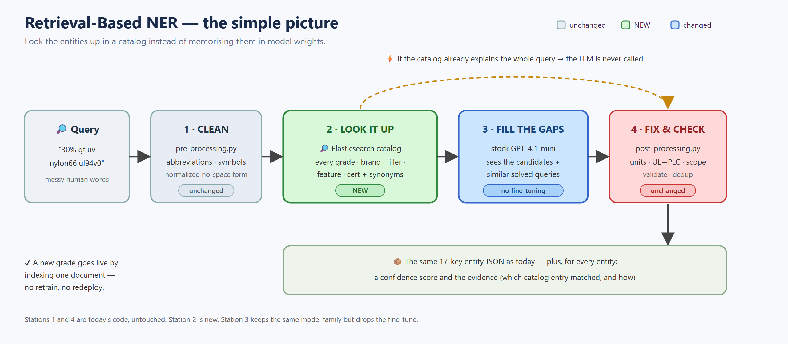
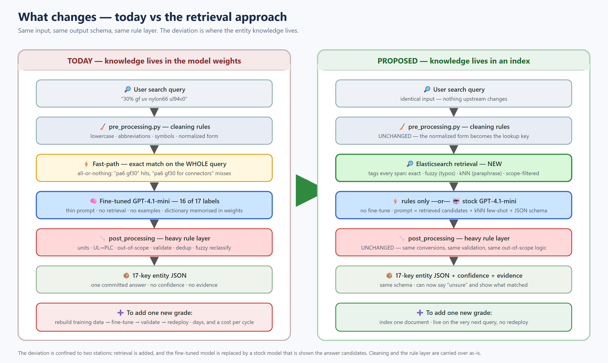
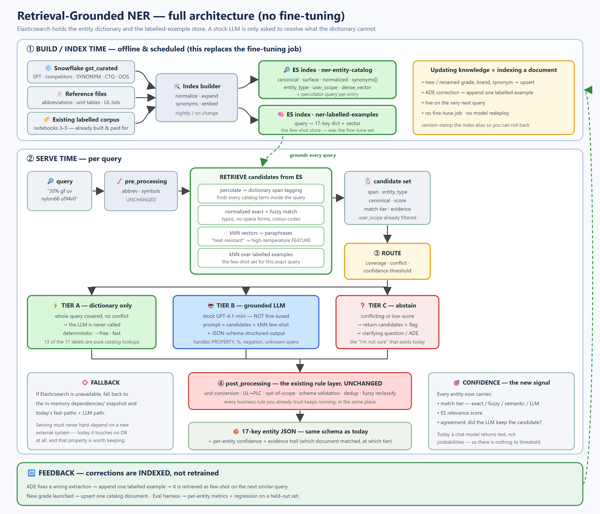
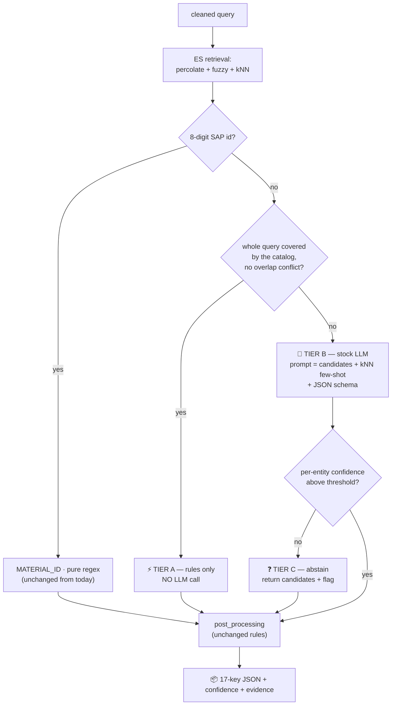

# 15. Retrieval-Based NER — an approach with **no fine-tuning** 🔎

> **Status: PROPOSAL.** This is a design, not a decision and not a record of anything built.
> Nothing in `onlinescoring/` works this way today. Everything below is written against the
> current code so the comparison is honest — see [`13-how-ner-prediction-works.md`](13-how-ner-prediction-works.md)
> and [`11-rulebased-vs-llm.md`](11-rulebased-vs-llm.md) for the verified description of today's system.

---

## 0. TL;DR

- **The idea:** stop making the model *memorise* the Celanese catalog. Put the catalog in
  **Elasticsearch**, look it up per query, and hand the results to a **stock (non-fine-tuned)** LLM
  that only has to resolve what the lookup couldn't.
- **Why it works here:** of the 17 labels, **13 are pure catalog lookups**, 3 more are a catalog
  lookup plus a number/unit, and only **PROPERTY** genuinely needs language parsing. We fine-tuned a
  model to memorise a dictionary we already own and already ship in `dependencies/`.
- **What replaces fine-tuning:** the existing labelled corpus (notebooks 3–5) becomes a
  **kNN-retrieved few-shot store**. Where you would have retrained, you now **index a document**.
- **Biggest win:** new catalog items are live immediately, and you finally get a
  **confidence signal** — today's single biggest gap ([`13`](13-how-ner-prediction-works.md) §7).
- **Biggest new risk:** extraction quality becomes bounded by **data coverage** rather than model
  generalisation, and per-query **determinism** gets harder to guarantee. Both are addressed in §9.

---

## 1. The simple picture



```
  query ──► CLEAN ──► LOOK IT UP ──► FILL THE GAPS ──► FIX & CHECK ──► JSON
            (same)    (NEW: ES)      (stock LLM)        (same)
                          │                                ▲
                          └──── whole query explained ─────┘
                                 ⚡ LLM never called
```

Four stations instead of three. Stations 1 and 4 are **today's code, untouched**. Station 2 is new.
Station 3 keeps the same model family but drops the fine-tune.

---

## 2. What we do today (the current approach)

Verified against `ner_helper.py` / `score.py`:

| Stage | What happens | Where |
|-------|--------------|-------|
| 1. Clean | lowercase, strip symbols, expand abbreviations (`gf` → `glass fiber`), build a normalized no-space form | `pre_processing.py` |
| 2. Fast-path | if the **whole query** exactly matches a catalog entry (GRADE / COMPETITOR_GRADE / AUTO_CERT / single FEATURE) or an 8-digit SAP id, return immediately | `ner_helper.py` ~805–1193 |
| 3. Understand | otherwise send a **thin prompt + raw query** to a **fine-tuned GPT-4.1-mini** (`temperature=0.01`, `seed=12`). No retrieval, no examples, no entity list in the prompt | `ner_helper.get_entities` ~525 |
| 4. Fix & check | heavy rule layer: fuzzy GRADE⇄COMPETITOR reclassify, unit conversion, UL→PLC, eco-r/b/c expansion, brand validation, schema validation, out-of-scope filter, dedup | `ner_helper.py` + `post_processing.py` |

**Where the knowledge lives:** in the **model weights**. The gazetteers in `dependencies/` are used
only by the *rules* (fast-paths and validation) — they are never shown to the model. Serving touches
**no database**; `init()` loads everything into memory once.

**How knowledge is updated:** rebuild training data → fine-tune → validate → redeploy.

---

## 3. The deviation — what actually changes



| Aspect | Today | Proposed | Verdict |
|---|---|---|---|
| **Where entity knowledge lives** | fine-tuned model weights | Elasticsearch index | 🔄 **the core deviation** |
| **How to add a grade / synonym** | retrain + redeploy (days) | index a document (seconds) | 🔄 changed |
| **Model** | fine-tuned GPT-4.1-mini | **stock** GPT-4.1-mini, no fine-tune | 🔄 changed |
| **Prompt** | thin instruction + query | instruction + **retrieved candidates** + **kNN few-shot** + JSON schema | 🔄 changed |
| **Catalog matching** | whole-query exact match only | **per-span** exact / fuzzy / semantic | 🔄 changed |
| **When the LLM is skipped** | rare (all-or-nothing fast-path) | often (any fully-covered query) | 🔄 changed |
| **Confidence / abstain** | none (only `unidentified` for junk) | per-entity score + tier + abstain path | ➕ new |
| **Out-of-scope filtering** | post-hoc scrub after extraction | a **filter clause** on retrieval | 🔄 moved earlier |
| `pre_processing.py` | cleaning rules | **identical** — the normalized form becomes the lookup key | ✅ unchanged |
| `post_processing.py` | unit conv, UL→PLC, validation, dedup | **identical** | ✅ unchanged |
| Output schema | 17-key dict | **same 17-key dict** (+ optional confidence block) | ✅ unchanged |
| `score.py` contract | `{data, user_type}` → JSON | same | ✅ unchanged |
| Azure ML deployment shape | online endpoint | same | ✅ unchanged |

**In one line:** retrieval is inserted before the model, and the model stops being a memory.
Everything either side of it is carried over as-is.

---

## 4. The full architecture



### 4.1 Build time (replaces the fine-tuning job)

Two indices, built by a scheduled job from the sources you already read in notebooks 1–5:

| Index | Contents | Purpose |
|---|---|---|
| `ner-entity-catalog` | one doc per canonical value: `canonical`, `surface`, `normalized`, `synonyms[]`, `entity_type`, `user_scope`, `embedding`, `match_query` (percolator) | the dictionary |
| `ner-labelled-examples` | `query` → 17-key dict, + embedding | the **few-shot store** (was the fine-tune set) |

```json
PUT ner-entity-catalog
{
  "settings": {
    "analysis": {
      "analyzer": {
        "material": {
          "tokenizer": "standard",
          "filter": ["lowercase", "asciifolding", "material_delims"]
        }
      },
      "filter": {
        "material_delims": {
          "type": "word_delimiter_graph",
          "generate_word_parts": true,
          "generate_number_parts": true,
          "catenate_all": true          // pa6-gf60-01  ≈  pa6gf6001
        }
      }
    }
  },
  "mappings": {
    "properties": {
      "canonical":   { "type": "keyword" },
      "surface":     { "type": "text",    "analyzer": "material" },
      "normalized":  { "type": "keyword" },
      "synonyms":    { "type": "text",    "analyzer": "material" },
      "entity_type": { "type": "keyword" },
      "user_scope":  { "type": "keyword" },
      "embedding":   { "type": "dense_vector", "dims": 768,
                       "index": true, "similarity": "cosine" },
      "match_query": { "type": "percolator" }
    }
  }
}
```

### 4.2 Serve time — the three retrieval moves

**a) Percolate = dictionary span tagging.** Index each catalog entry *as a query*; percolate the
user's search string. One round-trip returns every catalog term present in the query, with its type:

```json
GET ner-entity-catalog/_search
{
  "query": {
    "bool": {
      "must":   [{ "percolate": { "field": "match_query",
                                  "document": { "text": "30% glass fiber uv nylon66 ul94v0" } } }],
      "filter": [{ "terms": { "user_scope": ["all", "external"] } }]
    }
  }
}
```

This is the piece that generalises today's fast-paths. Today they only fire on a **whole-query**
exact match — `"pa6 gf30"` hits, `"pa6 gf30 for connectors"` misses entirely. Percolation tags
*spans*, so partial coverage becomes usable.

**b) Fuzzy + normalized exact** — typos, no-space forms, colour-code variants
(`fuzziness: AUTO` over `surface`, `term` over `normalized`).

**c) kNN vectors** — paraphrases the dictionary can't spell out
(`"heat resistant"` → FEATURE `high temperature resistance`), plus a second kNN over
`ner-labelled-examples` to pull the few-shot set for this specific query.

### 4.3 Routing



```
   query ─► ES retrieval
              │
              ├─ 8-digit SAP id? ──yes──► MATERIAL_ID (regex, as today) ─┐
              │                                                          │
              ├─ whole query covered, no conflict? ──yes──► TIER A ──────┤
              │        (rules only — the LLM is never called)            │
              │                                                          │
              └─ no ─► TIER B: stock LLM, grounded on candidates ────────┤
                          │                                              │
                          └─ low confidence? ──► TIER C: abstain ────────┤
                                                                         ▼
                                                      post_processing (unchanged)
                                                                         │
                                                                         ▼
                                              17-key JSON + confidence + evidence
```

### 4.4 The Tier-B prompt

```
[STATIC — cacheable prefix]
  You extract Celanese material entities. Return ONLY the 17-key schema.
  <JSON schema — enforced via structured output, not learned>
  <2 examples showing the output shape>

[DYNAMIC — per query]
  CANDIDATES FOUND IN THE CATALOG (authoritative — prefer these canonical values):
    "nylon66"  → POLYMER  · canonical "pa 66"        · exact   · 1.00
    "glass fiber" → FILLER · canonical "glass fiber" · exact   · 1.00
    "uv"       → FEATURE   · canonical "uv stabilized" · fuzzy · 0.86
    "ul94v0"   → PROPERTY  · flammability             · exact  · 1.00

  SIMILAR QUERIES ALREADY LABELLED (nearest neighbours):
    <8–15 examples retrieved from ner-labelled-examples>

  QUERY: 30% glass fiber uv nylon66 ul94v0
```

Put the static block **first** so it can be prompt-cached; only the dynamic tail varies.

---

## 5. Why this genuinely replaces fine-tuning

The fine-tune teaches two things: **(a)** the Celanese vocabulary, **(b)** the output shape.

| What the fine-tune provides | Replacement | Cost of the swap |
|---|---|---|
| Vocabulary (grades, brands, synonyms, certs) | `ner-entity-catalog` retrieval | none — the data already exists in `dependencies/` and Snowflake |
| Output shape / 17-key schema | **JSON-schema structured output** (enforced at decode) | none, and it's *stronger* — schema violations become impossible rather than merely rare |
| Domain phrasing / messy-query habits | **kNN few-shot** from the existing labelled corpus | ~2–4k extra prompt tokens per LLM call |

The labelled corpus you already built and paid for (synthetic notebook 3 + ~15 ADE-reviewed sets
from notebook 4, normalized in notebook 5) is **not thrown away** — it becomes the few-shot index.
Every future correction is one more document in it.

---

## 6. Few-shot: is it a good idea? (asked directly — here's the split answer)

| Flavour | Verdict | Why |
|---|---|---|
| **Static few-shot** (fixed examples in the prompt) | ⚠️ weak on its own | 17 labels with 6 nested structures need far more than a handful of examples; gives **zero** grounding on new catalog items; burns tokens on every call regardless of relevance |
| **Dynamic few-shot** (kNN-retrieved per query) | ✅ **this is the real fine-tune substitute** | the neighbours are drawn from the same distribution the model would have been fine-tuned on — delivered per query, updatable instantly |

Use static few-shot **only** as a 2–3 example schema anchor inside the cacheable prefix. Everything
content-bearing should be retrieved.

---

## 7. Non-GPT / zero-training options

| Option | Training needed | Verdict |
|---|---|---|
| **Dictionary + rules only** (percolate, no LLM) | none | Excellent for Tier A. Cannot do PROPERTY parsing, percentages, or negation. Not sufficient alone. |
| **GLiNER** (zero-shot span NER) | **none** — entity types are passed at inference | Useful as a **span detector** for text the dictionary misses ("this token behaves like a grade"), then resolved via ES fuzzy/kNN. Runs on CPU, no per-token cost. Weak on Celanese-specific vocabulary as a primary extractor. |
| **spaCy `EntityRuler` / Aho-Corasick in-process** | none | A no-Elasticsearch variant of the same idea — keeps serving DB-free. Loses fuzzy + semantic matching and the shared, instantly-updatable index. Worth considering if adding an external dependency is unacceptable. |
| Encoder fine-tune (SpanMarker, BERT-NER) | **yes** | Out of scope — you asked for no fine-tuning. |

---

## 8. Current limitations (what's wrong today)

Sourced from [`13-how-ner-prediction-works.md`](13-how-ner-prediction-works.md) §7–9, all code-grounded:

| # | Limitation | Consequence |
|---|---|---|
| 1 | **No confidence, no abstain** — a chat model returns text, not probabilities | when wrong, it is **confidently and silently** wrong |
| 2 | **No retrieval grounding** — recognition frozen at fine-tune time | a new grade/synonym is missed until someone retrains *or* hand-adds a rule |
| 3 | **Fast-path is all-or-nothing** — whole-query exact match only | rarely fires on realistic queries; almost everything pays for an LLM call |
| 4 | **Retrain to update knowledge** | days of latency + cost per catalog change |
| 5 | **Heavy hand-maintained rule/synonym layer** | powerful but brittle; synonym maps rot silently |
| 6 | **Nested-entity shape errors** — the 6 structured entities | validators repair some; bad values still pass |
| 7 | **Thin evaluation** — ~20 ADE use cases | passing them ≠ generalising; blind spots invisible |
| 8 | **CTQ ↔ application ↔ grade not modelled** | the actual business question can't be answered by flat entity lists |
| 9 | **Data/knowledge gaps surface as model bugs** | bug 217995 (Zytel/Celanyl) was a de-confliction miss, not a model error |
| 10 | **Elasticsearch wired but unused** | dead config that misleads readers about the live path |

---

## 9. Limitations **after** this change (the honest list)

Some of the above are fixed. Others are not — and the new design introduces **its own** failure
modes. Do not adopt this believing it is strictly better.

### 9.1 Fixed

| Old limitation | Why it's fixed |
|---|---|
| 1 · no confidence | match tier + ES score + LLM-agreement give a real, thresholdable signal |
| 2 · no grounding | the catalog is read per query, live |
| 3 · all-or-nothing fast-path | percolation tags spans, so partial coverage is usable |
| 4 · retrain to update | upsert one document |
| 10 · dead ES wiring | Elasticsearch becomes load-bearing and honest |

### 9.2 Not fixed — carried over unchanged

| Limitation | Note |
|---|---|
| 5 · heavy rule layer | `post_processing.py` is deliberately untouched. All its brittleness comes along. |
| 6 · nested-entity errors | **improved** by JSON-schema enforcement (shape), **not solved** (values can still be wrong) |
| 7 · thin evaluation | retrieval doesn't create test data. This must be fixed *before* the migration, not after — see §10. |
| 8 · CTQ ↔ application ↔ grade | retrieval improves **lookup**, not **reasoning**. This needs the knowledge-graph direction, not this design. |
| 9 · data gaps | if the catalog data is wrong, retrieval returns wrong candidates faster and more confidently |

### 9.3 New limitations this design introduces

| # | New risk | Why it happens | Mitigation |
|---|---|---|---|
| 1 | **Coverage becomes the ceiling** | today the model can *generalise* to phrasing outside the gazetteer; retrieval can only return what's indexed | keep the LLM tier for uncovered spans — never route on retrieval alone |
| 2 | **Over-tagging / span conflicts** | `PA66` inside `Zytel PA66 GF30`; `carbon` as FILLER vs `carbon capture` as FEATURE | longest-span-wins + entity-type priority + LLM arbitration on overlaps — **this is new rule surface area**, not a free lunch |
| 3 | **Determinism regression** ⚠️ | today `temp=0.01` + `seed=12` → identical answer forever. With dynamic few-shot, the prompt changes as the example store grows, so **the same query can drift over time with no code change** | version/snapshot the example index, pin the retrieval sort with a deterministic tie-break, cache resolved queries. This matters a lot for search consistency — treat it as a first-class requirement, not a detail. |
| 4 | **Example poisoning** | one bad labelled example used to be diluted across a whole fine-tune; now it can dominate a single query's prompt | review gate on appended examples; keep a held-out regression set that runs on every index publish |
| 5 | **New live dependency** | serving touches no DB today — that's a genuinely valuable property being given up | keep the in-memory `dependencies/` snapshot as a fallback path; ES down ⇒ degrade to today's behaviour, don't fail |
| 6 | **Two systems of record** | index + snapshot fallback can drift apart | build both from the same job, stamp both with the same version |
| 7 | **Semantic drift from kNN** | embeddings may equate `flame retardant` with `flammability rating`; general-purpose embeddings are weak on chemistry jargon | require a minimum similarity, mark semantic matches as a lower tier, evaluate embeddings on your own vocabulary before committing |
| 8 | **Higher token cost per LLM call** | few-shot + candidates ≈ +2–4k tokens vs today's thin prompt | offset by Tier A skipping the LLM entirely; cache the static prefix. **Net cost must be measured, not assumed.** |
| 9 | **Added latency per query** | +1 ES round-trip (~10–30 ms); percolation over a large catalog can be slower | large win when Tier A hits (skips a ~1 s LLM call); measure percolate latency at real catalog size early |
| 10 | **Confidence is heuristic, not calibrated** | ES relevance scores are not probabilities | present as tiers (exact / fuzzy / semantic / LLM), not as a percentage — false precision is worse than none |
| 11 | **New pipeline to own** | index builder, mappings, embeddings, aliases, rollback | real engineering cost; it replaces the fine-tune pipeline rather than adding to it, but it is not zero |

### 9.4 Summary

```
   FIXED ─────────────► confidence · live vocabulary · per-span matching · instant updates
   CARRIED OVER ──────► rule-layer brittleness · thin eval · CTQ reasoning gap · data quality
   NEWLY INTRODUCED ──► coverage ceiling · span conflicts · determinism drift · ES dependency
```

---

## 10. Rollout — and how to decide go/no-go

| Phase | Do | Decision gate |
|---|---|---|
| **0. Build an eval set first** | carve a few hundred labelled queries out of the existing corpus and **hold them out** of the few-shot index | you cannot judge any of this against ~20 ADE use cases |
| **1. Index + percolate, shadow mode** | index the gazetteers; run retrieval alongside the live service; log coverage. **Change nothing user-facing.** | **what % of real queries are fully dictionary-covered?** That number is the entire business case |
| **2. Tier A only** | serve dictionary-only queries from rules; everything else stays on the current fine-tuned model | Tier A accuracy ≥ current on the held-out set; latency/cost improve |
| **3. Tier B** | stock model + candidates + kNN few-shot; A/B against the fine-tuned model | per-entity F1 within tolerance, determinism checks pass |
| **4. Confidence + abstain, OOS as a filter** | expose tiers; move `user_type` scoping into the retrieval filter | fewer confidently-wrong answers on the regression set |
| **5. Retire the fine-tune** | only once phases 2–4 hold | — |

**Do phase 1 regardless of whether you adopt the rest.** It is cheap, reversible, changes no
behaviour, and tells you whether the idea is worth pursuing.

---

## 11. Open questions before committing

1. What **is** the dictionary coverage of real production queries? (phase 1 answers this)
2. Is a **live ES dependency at serving time** acceptable, given the service currently has none?
3. Which embedding model handles polymer/chemistry vocabulary acceptably — and who evaluates it?
4. ES licence tier: native hybrid **RRF ranking is a paid feature** — is app-side score fusion fine?
5. Who owns the review gate on appended few-shot examples?
6. Is prompt-driven drift (§9.3 #3) tolerable for search consistency, or must results be pinned?

---

⬅️ Back to [`00-README-START-HERE.md`](00-README-START-HERE.md) · related:
[`13-how-ner-prediction-works.md`](13-how-ner-prediction-works.md) ·
[`11-rulebased-vs-llm.md`](11-rulebased-vs-llm.md) ·
[`12-bug-217995-zytel-casestudy.md`](12-bug-217995-zytel-casestudy.md)
