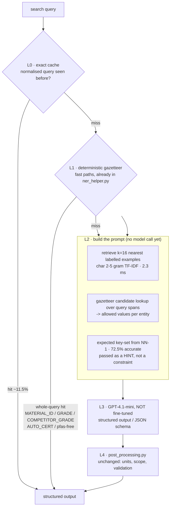

# 20 · Replacing fine-tuning with retrieval — measured on our own 68k

**The question:** we have 68,428 labelled examples. Can we get the same or better
NER without fine-tuning a GPT model?

**The short answer:** yes — but not the way it is usually pitched. I ran the
retrieval idea against our own held-out data before proposing it, and the naive
version fails. The measurements point at a specific architecture that works.

This doc supersedes the design sketch in `15-retrieval-based-ner-approach.md`,
which was written before we had the corpus to test it on.

Reproduce everything here with:

```bash
python knn_feasibility.py      # experiment 1 - can retrieval answer directly?
python knn_feasibility2.py     # experiment 2 - where do entity values live?
```

---

## 1. TL;DR

| | |
|---|---|
| **Does kNN-copy replace the model?** | **No.** 17.1% exact match. Even with 16 neighbours the right answer is present only 22.5% of the time. |
| **Does retrieval know *what to extract*?** | **Yes.** Nearest neighbour predicts the exact entity key-set **72.5%** of the time. |
| **Where do entity *values* come from?** | **98.4%** are findable — but split: open-vocabulary (GRADE, COMPETITOR_GRADE) from the **gazetteer**, closed-vocabulary (PROPERTY, POLYMER, FEATURE, BRAND, FILLER) from the **examples**. |
| **So the design is…** | **Two indexes, not one**, plus an unchanged LLM doing only what it is good at. |
| **Is fine-tuning avoidable?** | Yes. The 68k becomes a *retrieval corpus* instead of a *training set* — and stays editable without a retraining cycle. |

---

## 2. The experiment

Held out 10% of `Training_Data_14_07_2026.xlsx`, indexed the other 90%.

```
68,427 usable rows (1 null Query dropped)
   index      61,585
   held-out    6,056   after removing 786 queries that appear verbatim in the index
```

Removing those 786 matters. They are **11.5% of the held-out slice** — real
repeated traffic that any cache answers for free. Leaving them in would have
inflated every number below and taught us nothing about generalisation.

Retrieval: TF-IDF over **character 2–5 grams** (`char_wb`), cosine, brute force.
Character n-grams rather than words because our queries are full of things like
`pa66gf30` and `celanex 2002-2`, where word tokens are useless.

> **119k features, 2.3 ms per query** against 61,585 rows on a laptop CPU.
> Retrieval latency is not a concern at this scale.

### 2.1 Result A — pure retrieval cannot answer

| Metric | Score |
|---|---|
| Nearest neighbour's answer copied verbatim | **17.1%** |
| Gold answer present anywhere in top-4 | 20.2% |
| Gold answer present anywhere in top-8 | 21.5% |
| Gold answer present anywhere in top-16 | **22.5%** |

That last row is the important one. It is the **ceiling for any "retrieve and
copy" system**, and for a k-shot prompt where the model is only allowed to reuse
what it was shown. 22.5% is far below a fine-tuned model. Retrieval alone is dead.

It does not improve with a confidence gate either:

| Retrieval distance | Share of traffic | Copy correct |
|---|---:|---:|
| 0.0 – 0.2 | 43.9% | **35.2%** |
| 0.2 – 0.4 | 40.7% | 3.4% |
| 0.4 – 0.6 | 14.5% | 1.5% |

Even at very tight distance, copying is right about a third of the time. **There
is no safe copy shortcut.** Only the exact-duplicate cache is safe.

### 2.2 Result B — retrieval knows *what to look for*

| Metric | Score |
|---|---|
| NN-1 predicts the exact set of populated entity keys | **72.5%** |
| NN-1 recalls every gold key (may over-predict) | 76.7% |
| Majority vote over top-8 | 71.4% — *worse* |

Voting is worse than the single nearest neighbour, which is worth knowing before
anyone builds it. Keep NN-1.

Per entity (NN-1):

| Entity | Support | Recall | Precision |
|---|---:|---:|---:|
| COMPETITOR_GRADE | 2,640 | **98.4%** | **98.7%** |
| GRADE | 901 | 88.0% | 95.8% |
| RAILWAY_CERT | 120 | 90.0% | 91.5% |
| AUTO_CERT | 359 | 84.4% | 95.3% |
| PROPERTY | 867 | 81.4% | 95.1% |
| APPLICATION | 417 | 74.1% | 96.0% |
| PROCESSING | 204 | 70.6% | 86.7% |
| INDUSTRY | 351 | 70.4% | 91.5% |
| FILLER | 384 | 65.6% | 84.6% |
| FEATURE | 586 | 62.5% | 82.8% |
| POLYMER | 790 | 59.4% | 75.5% |
| DELIVERY_FORM | 90 | 57.8% | 48.6% |
| NSF_CERT | 86 | 57.0% | **36.3%** |
| REGION | 235 | 55.3% | 77.4% |
| BRAND | 526 | **48.5%** | 59.6% |

Strong where the corpus is dense, weak on BRAND, NSF_CERT and DELIVERY_FORM.
Those three need the LLM, not retrieval.

### 2.3 Result C — the finding that decides the architecture

Where can each gold entity **value** actually be found?

| Entity | Gold values | In the **examples** | In the **gazetteer** | Either |
|---|---:|---:|---:|---:|
| COMPETITOR_GRADE | 2,641 | 32.1% | **98.0%** | 99.1% |
| GRADE | 901 | 34.3% | **86.2%** | 90.9% |
| PROPERTY | 1,345 | **99.9%** | 72.5% | 99.9% |
| POLYMER | 849 | **99.8%** | 92.7% | 99.8% |
| FEATURE | 675 | **99.7%** | 80.3% | 99.9% |
| BRAND | 586 | **100.0%** | 78.3% | 100.0% |
| FILLER | 429 | **100.0%** | 89.5% | 100.0% |
| AUTO_CERT | 760 | **97.0%** | 75.0% | 98.9% |
| APPLICATION | 418 | 89.2% | 52.6% | 94.3% |
| NSF_CERT | 86 | 100.0% | 96.5% | 100.0% |
| CHEMICAL_RESISTANCE | 36 | 100.0% | 100.0% | 100.0% |
| MEDICAL_CERT | 4 | 100.0% | 100.0% | 100.0% |
| **ALL** | **8,730** | **71.8%** | **85.1%** | **98.4%** |

Read the two bold columns. There is a clean split:

- **Open-vocabulary entities — GRADE, COMPETITOR_GRADE.** Only ~⅓ of held-out
  values appear in 61k examples, but **86–98% are in the gazetteer**. New grades
  appear constantly; no training set can keep up, and no training set needs to.
- **Closed-vocabulary entities — PROPERTY, POLYMER, FEATURE, BRAND, FILLER,
  certifications.** ~100% covered by the examples. These are bounded lists.

**98.4% of every entity value we need is already retrievable from one of the two
sources.** Nothing has to be memorised in model weights. That is the whole
argument for dropping fine-tuning, and it is measured rather than asserted.

> Note on the gazetteer numbers: values had to be compared with punctuation
> stripped. The gazetteer stores `celanex20022`, training stores
> `celanex 2002-2`. Comparing raw strings reported GRADE coverage as 33% instead
> of 86% — an artefact, not a finding.

---

## 3. The architecture the evidence points to



### Why each layer exists — tied to a measurement

| Layer | Justified by |
|---|---|
| **L0 exact cache** | 11.5% of held-out queries were verbatim repeats. Free accuracy, ~0 ms, zero risk. |
| **L1 gazetteer fast paths** | Already exists. COMPETITOR_GRADE + GRADE are **53.8%** of corpus mass and 86–98% gazetteer-covered. Deterministic beats probabilistic here. |
| **L2 retrieved examples** | Closed-vocabulary values are ~100% present in the examples. Showing 16 near neighbours puts the exact legal strings in context. |
| **L2 gazetteer candidates** | Turns open-vocabulary extraction into *selection from a list* — the model picks, it does not invent. |
| **L2 key-set hint** | 72.5% accurate. Cheap steer on what to look for. **Must be a hint** — enforcing it would cap recall at 76.7%. |
| **L3 non-fine-tuned LLM** | Retrieval tops out at 22.5% alone. The model is still doing the linguistic work; it just no longer has to *memorise* the vocabulary. |
| **L4 post-processing** | Untouched. All business logic, unit conversion and scope rules keep working. |

### What actually changes vs today

| | Today | Proposed |
|---|---|---|
| Model | GPT-4.1-mini **fine-tuned** | GPT-4.1-mini **stock** |
| Vocabulary knowledge | baked into weights | retrieved per request |
| Prompt | short system prompt | system + 16 retrieved examples + candidate lists |
| Adding a new grade | regenerate corpus → retrain → redeploy | **insert one row into the index** |
| Fast paths | unchanged | unchanged |
| `post_processing.py` | unchanged | unchanged |

**The service shape does not change.** `score.py` → `ner_helper.run_ner()` →
LLM → `post_processing.py` stays exactly as it is. L2 is a new function between
the fast paths and the LLM call.

---

## 4. The prompt

```
SYSTEM
  Act as an NER model for Celanese… (keep the existing system prompt verbatim —
  it is the one the corpus was written against)
  Output exactly these 18 keys, empty lists where nothing applies.

  # Values you may use for closed entities
  FEATURE:      <41 gazetteer values>
  DELIVERY_FORM: <5>
  PROCESSING:   <28>
  CHEMICAL_RESISTANCE: <11 categories>
  MEDICAL_CERT: <8>

  # Candidates found in this query by gazetteer lookup
  GRADE candidates:            ["celanex 2002-2"]
  COMPETITOR_GRADE candidates: []

  # Likely entity types for this query (hint only, may be wrong)
  POLYMER, FILLER, PROPERTY

  # Examples
  <16 nearest labelled examples, query → Output, verbatim from the 68k>

USER
  <the query>
```

Three deliberate choices:

1. **Reuse the existing system prompt unchanged.** All 68k assistant messages
   were written to answer *that* prompt. Changing it invalidates the examples.
2. **Closed vocabularies inline, open vocabularies as per-query candidates.**
   41 FEATURE values fit in a prompt; 56,885 competitor grades do not.
3. **The key-set is a hint.** Enforcing it caps recall at 76.7% — worse than
   letting the model see the hint and disagree.

**Prompt caching matters here.** The static block (system prompt + closed
vocabularies) is identical on every request, so it caches at up to 90% off, and
only the examples and candidates are billed fresh. That is what makes a
~16-example prompt affordable in production.

---

## 5. What I would *not* do, and why

**Many-shot ICL (hundreds of examples in context).** DeepMind's NeurIPS 2024
result shows 15–20% gains going from 5 to 500 examples on complex tasks. Tempting
with a 1M-token context. But our task is not reasoning-limited, it is
*vocabulary*-limited, and Result C shows targeted retrieval already surfaces 98.4%
of needed values in 16 examples. 500 random examples would cost ~30× more per
call to solve a problem we do not have. **Retrieve 16 good ones instead of 500
random ones.** Worth an A/B at k = 8/16/32, not worth going to 500.

**GLiNER or another encoder NER model.** Genuinely strong zero-shot, CPU-fast,
and no LLM bill. But it returns *spans*, and our schema is nested — `PROPERTY`
carries `property_name` + `modifier{value,min,max,unit}` + `property_type`, and
`FILLER` carries `filler_name` + `total_load`. Span tagging cannot produce the
±10% band or the unit normalisation. Possible as a **candidate generator feeding
L2**, not as a replacement.

**A domain embedding model (MatSciBERT / ChemBERTa / ChemTEB-ranked models).**
These are trained on scientific *prose*. Our queries are 3–4 word product codes.
Character n-gram TF-IDF is a better fit for `pa66gf30` and it costs nothing.
Revisit only if retrieval quality plateaus on long natural-language queries.

**Dropping the LLM entirely.** 22.5% oracle@16 settles it.

---

## 6. Build order

Each step is independently shippable and independently measurable.

| # | Step | Effort | Measure |
|---|---|---|---|
| 1 | **L0 exact cache** on normalised query | hours | hit rate ≈ 11.5%, latency |
| 2 | **Offline harness**: replay the 6,056 held-out queries through the *current* fine-tuned service, record per-entity F1 | 1–2 days | **this is the baseline everything is judged against** |
| 3 | **L2 retrieval** (index + candidate lookup), no serving change | 2–3 days | already measured — 2.3 ms, 72.5% routing |
| 4 | **Stock model + retrieved prompt**, offline only | 2–3 days | per-entity F1 vs step 2 |
| 5 | Tune k, candidate depth, hint on/off | 1 week | same harness |
| 6 | Shadow traffic, then % rollout | — | live agreement rate |

**Step 2 is not optional.** We currently have no per-entity F1 number for the
production model. Without it, "similar or better results" cannot be verified in
either direction.

---

## 7. Honest limitations

### Fixed by this

- **Vocabulary drift.** New grades appear via a data update rather than a
  retraining cycle. Directly addresses the Zytel class of bug (`12-…-casestudy.md`).
- **Retraining latency.** Today a label fix means regenerate → retrain → redeploy.
- **Corpus/label mismatch.** MEDICAL_CERT and CHEMICAL_RESISTANCE are 0.5% and
  1.7% of the corpus — far too thin to fine-tune reliably. As retrieved examples
  plus a closed vocabulary list, thin coverage is much less damaging.

### Carried over unchanged

- Everything in `post_processing.py`, including the open bugs: `active |=` at
  `:793`, `reclassify_feature_to_chem_res()` losing the chemical, DMF being both
  valid (`:520`) and out-of-scope (`:900`).
- Multi-entity queries. 70.5% of the corpus is single-entity, so the retrieved
  neighbours skew single-entity too. Copy accuracy on 3-entity queries was 8.3%
  vs 19.6% on 1-entity. **Retrieval does not fix this; better multi-entity
  templates in notebook 3 would.**
- The chemical-specific `FEATURE` labels (`oil resistant`, `fuel resistant`) that
  are not in the 41-value gazetteer. Bad labels retrieve as readily as good ones.

### New risks this introduces

| Risk | Mitigation |
|---|---|
| Longer prompts → higher per-call cost and latency | prompt caching on the static block; measure at step 4 |
| Bad training rows now influence output *directly* rather than being averaged away by training | the 99 conflicting duplicates found in doc 19 must be cleaned first |
| Retrieval index becomes a new production dependency | it is a 61k-row TF-IDF matrix — small enough to load in-process, no new service |
| Quality now depends on retrieval quality | monitor NN-1 distance distribution in production; alert on drift |

**The most important one is the second.** Under fine-tuning, a handful of bad
rows get diluted. Under retrieval, a bad row that gets retrieved is shown to the
model as an authoritative example. **Clean the 99 conflicts and the null row
before indexing.**

---

## 8. Where this leaves fine-tuning

Not "never" — but the case for it is now narrow. Fine-tuning buys compact prompts
and no retrieval dependency. It costs a retraining cycle per data change, and it
cannot keep up with a grade vocabulary that turns over continuously — which is
the failure mode we actually keep hitting.

Given 98.4% retrievable value coverage and 72.5% routing accuracy from a 2.3 ms
CPU lookup, **retrieval is the better default for this task.** What is not yet
measured is end-to-end extraction quality against the current model. Step 2 of
the build order closes that gap, and the decision should be made on that number.

---

## Sources

- [Many-Shot In-Context Learning (Google DeepMind, NeurIPS 2024)](https://arxiv.org/abs/2404.11018) · [NeurIPS PDF](https://proceedings.neurips.cc/paper_files/paper/2024/file/8cb564df771e9eacbfe9d72bd46a24a9-Paper-Conference.pdf)
- [Rethinking Example Selection in the Era of Million-Token Models (DeepMind)](https://deepmind.google/research/publications/rethinking-example-selection-in-the-era-of-million-token-models/)
- [Retrieval-augmented dynamic prompting for few-shot biomedical NER (PMC)](https://www.ncbi.nlm.nih.gov/pmc/articles/PMC12408026/)
- [Improving Few-Shot Cross-Domain NER with a Word-Embedding Retrieval-Augmented LLM](https://arxiv.org/pdf/2411.00451)
- [Retrieval-Augmented Few-Shot Prompting vs Fine-Tuning](https://arxiv.org/abs/2512.04106)
- [GLiNER: Generalist Model for NER (NAACL 2024)](https://aclanthology.org/2024.naacl-long.300.pdf) · [GLiNER2 (EMNLP 2025 demos)](https://aclanthology.org/2025.emnlp-demos.10.pdf)
- [ChemTEB: Chemical Text Embedding Benchmark](https://arxiv.org/pdf/2412.00532) · [MatSciBERT (npj Comput. Mater.)](https://www.nature.com/articles/s41524-022-00784-w)
- [Hybrid LLM-Rule-based Data Extraction](https://arxiv.org/pdf/2404.15604)
- [LLM Caching Strategies: Prompt vs Semantic Caching (NeuralTrust)](https://neuraltrust.ai/blog/llm-caching-strategies)
