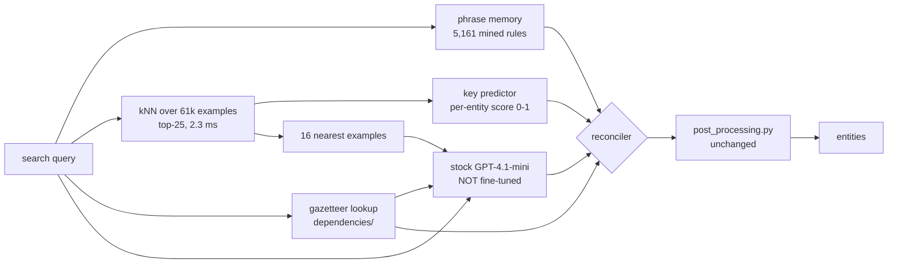

# 21 · Using the 68k at run time to correct the LLM — no fine-tuning

**Business constraint:** no more fine-tuning from here on.
**Requirement:** the LLM still produces the answer, but the 68,428 labelled
examples must actively improve the entities it returns — at run time.

This is not "put examples in the prompt and hope". The corpus becomes **three
runtime assets** that vote alongside the model, and a reconciler merges them.

Everything below is measured on a 6,056-row held-out slice, index of 61,585.
Reproduce with `python knn_label_predictor.py`.

Builds on `20-no-finetune-approach-evidence-based.md`.

---

## 1. The idea in one picture



The LLM keeps doing the language work. The corpus does three things it is
measurably better at: **remembering surface forms**, **predicting which entity
types belong**, and **supplying legal values**.

---

## 2. The three assets, and what each one is worth

### Asset 1 — Phrase memory (the headline result)

Mine every 1/2/3-gram in the 61k queries, keep those that co-occur with one
entity value at ≥85% confidence and ≥4 occurrences.

```
5,161 rules mined
held-out:  precision 95.5%   recall 70.7%    (tp 2,481 · fp 116 · fn 1,027)
```

**95.5% precision is production-grade for a deterministic lookup.** And look at
what it learned — this is domain knowledge sitting inside the corpus that the
gazetteer does not contain:

| Query surface form | → Entity | → Canonical value | conf | n |
|---|---|---|---:|---:|
| `micro powder` | DELIVERY_FORM | `micropowder` | 1.00 | 129 |
| `glass filled` | FILLER | `glass fiber` | 1.00 | 116 |
| `high heat` | FEATURE | `heat stabilized or stable to heat` | 1.00 | 77 |
| `avoid static` | FEATURE | `anti-static` | 1.00 | 69 |
| `chemical resistance` | FEATURE | `chemical resistant` | 0.99 | 79 |
| `6 12` | POLYMER | `pa612` | 0.99 | 81 |
| `for automotive` | INDUSTRY | `automotive & transportation` | 1.00 | 108 |
| **`iso 1817`** | CHEMICAL_RESISTANCE | `fuels` | 1.00 | 34 |
| **`mobil dte`** | CHEMICAL_RESISTANCE | `oils & greases` | 1.00 | 6 |
| **`lauryl alcohol`** | CHEMICAL_RESISTANCE | `long-chain alcohols` | 1.00 | 4 |
| **`skin irritation`** | MEDICAL_CERT | `dermal_irritation` | 1.00 | 5 |
| **`fever`** | MEDICAL_CERT | `pyrogenicity` | 1.00 | 4 |

The bolded rows are subject-matter expertise. *"ISO 1817 means fuels"*,
*"Mobil DTE is an oil"*, *"fever response means pyrogenicity"* — a chemist knew
that, a labeller wrote it down 34 times, and it is currently locked inside an
Excel file doing nothing. **This is exactly the `gene toxicity` / spacing-variant
class of gap we hit earlier**, solved generically instead of one term at a time.

By entity: INDUSTRY 1,523 · POLYMER 1,012 · FEATURE 898 · FILLER 512 ·
REGION 439 · BRAND 300 · PROCESSING 249 · CHEMICAL_RESISTANCE 128 ·
DELIVERY_FORM 81 · MEDICAL_CERT 19.

### Asset 2 — kNN key predictor

Similarity-weighted soft vote over the top-25 neighbours gives every entity a
score in 0–1. Far better than the hard majority vote tried in experiment 2.

| Entity | Support | Best F1 | P | R |
|---|---:|---:|---:|---:|
| COMPETITOR_GRADE | 2,640 | **0.99** | 0.99 | 0.99 |
| RAILWAY_CERT | 120 | **0.98** | 0.98 | 0.98 |
| PROCESSING | 204 | **0.91** | 0.98 | 0.84 |
| GRADE | 901 | 0.91 | 0.93 | 0.90 |
| PROPERTY | 867 | 0.90 | 0.93 | 0.87 |
| AUTO_CERT | 359 | 0.90 | 0.93 | 0.87 |
| APPLICATION | 417 | 0.85 | 0.91 | 0.79 |
| FEATURE | 586 | 0.81 | 0.93 | 0.72 |
| WATER_CERT | 101 | 0.81 | 0.85 | 0.78 |
| INDUSTRY | 351 | 0.79 | 0.81 | 0.77 |
| REGION | 235 | 0.78 | 0.87 | 0.71 |
| DELIVERY_FORM | 90 | 0.78 | 0.95 | 0.67 |
| FILLER | 384 | 0.76 | 0.83 | 0.70 |
| POLYMER | 790 | 0.72 | 0.73 | 0.71 |
| NSF_CERT | 86 | 0.63 | 0.56 | 0.71 |
| BRAND | 526 | 0.58 | 0.56 | 0.60 |

### Asset 3 — Value predictor (closed vocabularies)

| Entity | P | R | F1 |
|---|---:|---:|---:|
| PROCESSING | 82.8% | 79.9% | **81.3%** |
| DELIVERY_FORM | **94.9%** | 64.9% | 77.1% |
| FEATURE | 83.3% | 66.7% | 74.1% |
| INDUSTRY | 76.3% | 69.8% | 72.9% |
| REGION | 63.9% | 67.7% | 65.7% |
| FILLER | 70.5% | 52.9% | 60.5% |
| CHEMICAL_RESISTANCE | 64.5% | 55.6% | 59.7% |
| POLYMER | 63.8% | 46.3% | 53.7% |
| BRAND | 55.4% | 46.9% | 50.8% |

Weaker than the other two. Use it only to **canonicalise** a value the LLM
already produced, never to invent one.

---

## 3. The reconciliation policy

This is where the corpus actually changes the output. Three moves, each gated by
a *measured* operating point.

### Move 1 — ADD what the LLM missed

If the key predictor scores an entity above its **precision ≥ 0.95** threshold
and the LLM returned nothing for it, add it. The threshold is per entity because
the curves differ enormously:

| Entity | Add if score ≥ | Recall gained at that point |
|---|---:|---:|
| COMPETITOR_GRADE | 0.15 | **100%** |
| RAILWAY_CERT | 0.20 | 98% |
| PROCESSING | 0.25 | 84% |
| AUTO_CERT | 0.30 | 84% |
| GRADE | 0.45 | 84% |
| PROPERTY | 0.35 | 83% |
| APPLICATION | 0.35 | 68% |
| DELIVERY_FORM | 0.30 | 67% |
| FEATURE | 0.50 | 64% |
| WATER_CERT | 0.65 | 62% |
| REGION | 0.40 | 55% |
| FILLER | 0.60 | 53% |
| INDUSTRY | 0.60 | 39% |
| POLYMER | 0.70 | 35% |
| **NSF_CERT** | 0.75 | 17% — **not worth it** |
| **BRAND** | 0.95 | 5% — **leave to the LLM** |

Where the value comes from, once the key is asserted: phrase memory first
(95.5% precise), then gazetteer candidates, then the value predictor. If none
supplies a value, **do not add the key** — an entity with no value is worse than
a missing entity.

### Move 2 — CANONICALISE what the LLM produced

Run the LLM's values through phrase memory and the gazetteer. `micro powder` →
`micropowder`; `chemical resistance` → `chemical resistant`. This alone kills a
whole class of near-miss failures where the model was right but off-vocabulary.

### Move 3 — FLAG what the LLM invented — carefully

**Only two entities support safe dropping on kNN evidence**: COMPETITOR_GRADE
(precision 1.00 at score < 0.80) and RAILWAY_CERT (1.00 at < 0.45). For every
other entity the high-recall operating point was **unreachable** — a low kNN
score does *not* prove absence.

So for the rest, the drop test is membership, not score: if the LLM emits a value
for a closed-vocabulary entity that exists in **neither** the gazetteer **nor**
phrase memory, drop it. That is what catches `oil resistant` and
`fuel resistant` being emitted as FEATURE when they are not among the 41 legal
FEATURE values.

> **Do not drop on low kNN score alone.** The measurement says you cannot.

---

## 4. Where it plugs in

One new module, called between the fast paths and the LLM, and once after:

```python
# onlinescoring/corpus_evidence.py   (new)

class CorpusEvidence:
    """Loaded once in score.py:init(), like the gazetteers."""

    def __init__(self, index_dir):
        self.vec, self.X = load_tfidf(index_dir)      # 61k x 119k sparse
        self.outputs    = load_outputs(index_dir)      # aligned labels
        self.phrases    = load_json("mined_phrase_rules.json")
        self.add_thresh = load_json("add_thresholds.json")

    def evidence(self, query_cleaned):
        sims, nbrs = topk(self.vec, self.X, query_cleaned, k=25)
        return {
            "key_scores": soft_vote(nbrs, sims, self.outputs),
            "examples":   [self.outputs[j] for j in nbrs[:16]],
            "phrase_hits": scan_phrases(query_cleaned, self.phrases),
        }

    def reconcile(self, llm_output, ev, gazetteer_candidates):
        out = canonicalise(llm_output, ev["phrase_hits"], gazetteer_candidates)
        for entity, t in self.add_thresh.items():
            if not out.get(entity) and ev["key_scores"].get(entity, 0) >= t:
                v = value_for(entity, ev, gazetteer_candidates)
                if v:                       # never assert a key with no value
                    out[entity] = v
        return drop_unsupported(out, ev, gazetteer_candidates)
```

In `ner_helper.run_ner()`:

```
  ... fast paths (unchanged, still short-circuit) ...
  ev = CORPUS.evidence(search_query_cleaned)          # ~3 ms, CPU
  prompt = build_prompt(query, ev["examples"], gazetteer_candidates)
  raw = get_entities(prompt)                          # stock model
  result = CORPUS.reconcile(raw, ev, gazetteer_candidates)
  ... post_processing.py (unchanged) ...
```

`score.py`, `pre_processing.py` and `post_processing.py` are untouched. The
index is a sparse matrix plus a JSON — it loads in-process, no new service.

---

## 5. Build order

| # | Step | Why first | Effort |
|---|---|---|---|
| 1 | **Clean the corpus** — drop the null row, resolve the 99 conflicting duplicates, fix the chemical-specific FEATURE labels (doc 19 §fix) | every asset below is mined from it; garbage in is now *directly* visible in output | 1 day |
| 2 | **Phrase memory alone**, applied post-LLM as canonicalisation only | 95.5% precision, zero risk, no prompt change, ships independently of everything else | 2–3 days |
| 3 | **Offline harness** — replay the 6,056 held-out queries through the current fine-tuned service, per-entity F1 | there is no baseline today; without it nothing can be claimed | 1–2 days |
| 4 | **kNN evidence + retrieved-example prompt** on the stock model | measured at 2.3 ms; the accuracy question is settled here | 3–4 days |
| 5 | **Reconciler** with the thresholds above, tuned on held-out | | 3–4 days |
| 6 | Shadow, then percentage rollout | | — |

**Step 2 is the one I would ship first regardless of the rest.** It is a pure
win, it needs no model change, and it works with the *current* fine-tuned model
too — so it de-risks the whole programme while delivering value immediately.

---

## 6. Refreshing it

Adding knowledge stops being a training run and becomes a data commit:

```
new labelled rows  ->  append to corpus.xlsx
                   ->  rebuild TF-IDF index + re-mine phrases   (~2 min)
                   ->  re-tune thresholds on held-out           (~1 min)
                   ->  register data asset, restart deployment
```

No fine-tune job, no epoch cost, no model version to track. **This is the actual
business answer**: the 68k stops being a one-shot training input and becomes a
living asset that gets better every time someone labels a query.

---

## 7. Honest limits

- **Not measured end to end.** Every number here is the *corpus predictor's*
  quality, not the final ensemble's. Whether it beats the current fine-tuned
  model needs step 3 + step 4. I would expect gains on FEATURE, PROCESSING,
  DELIVERY_FORM, CHEMICAL_RESISTANCE and MEDICAL_CERT, and roughly parity on
  GRADE and COMPETITOR_GRADE where the fast paths already dominate.
- **BRAND and NSF_CERT get no help.** F1 0.58 and 0.63. The corpus has nothing
  useful to say; leave them entirely to the LLM.
- **Bad rows now speak directly.** Under fine-tuning a wrong label is diluted
  across 68k. Here, a wrong label with support ≥ 4 becomes a 95%-confidence rule.
  Step 1 is not optional.
- **Multi-entity queries stay weak.** 70.5% of the corpus is single-entity, so
  the neighbours are too. Fixing that means multi-entity templates in
  notebook 3, not anything in this design.
- **Phrase memory recall is 70.7%**, so it is a booster, not a replacement.
- The `post_processing.py` bugs (`active |=` at :793, DMF valid-vs-out-of-scope,
  `reclassify_feature_to_chem_res()`) are untouched by all of this.

---

## 8. Why this answers the business constraint

| | Fine-tuning | This |
|---|---|---|
| New grade or synonym | regenerate → retrain → redeploy | append a row, rebuild index (~2 min) |
| Cost per knowledge update | a fine-tune run | none |
| Who can add knowledge | ML engineer | anyone who can label a query |
| Where domain expertise lives | model weights, opaque | `mined_phrase_rules.json`, readable and reviewable |
| Auditability | none | every rule carries its confidence and support count |

That last row matters more than it looks. When a chemist disagrees with an
extraction today, there is nothing to point at. With phrase memory you can show
them `'iso 1817' → fuels, confidence 1.00, seen 34 times` — and they can correct
it directly.
